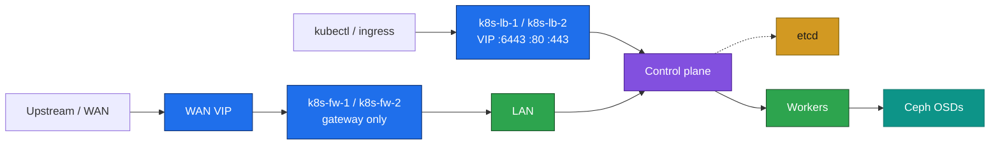
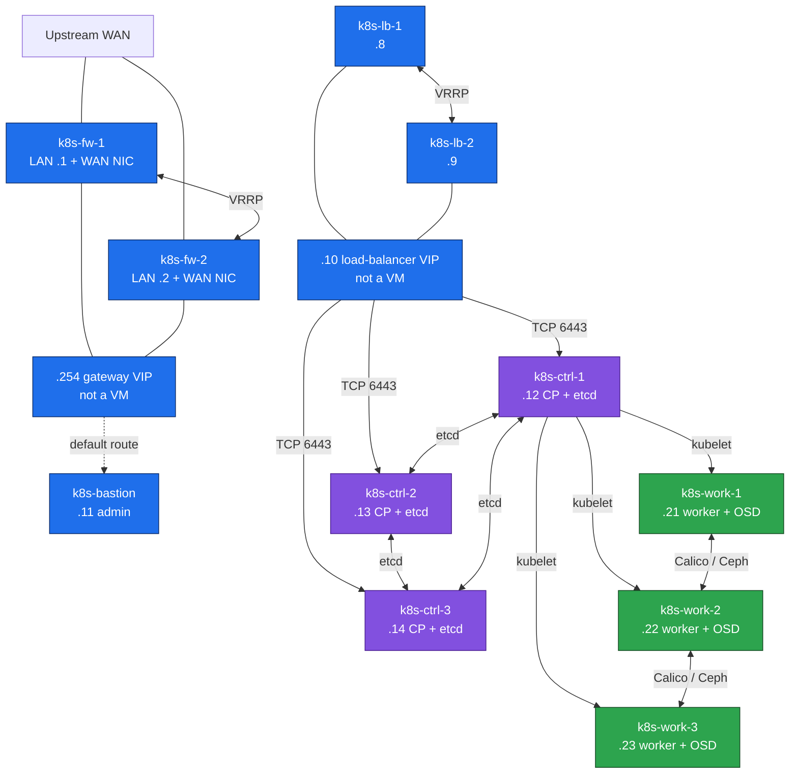

# 01. Inventory and network

**Goal:** VM list, resource budget, and the LAN plan for whichever profile and scenario you are deploying.

> VM creation is out of scope ([00-overview.md](00-overview.md)). These tables are what the VMs look like once they exist.

## One host, two scenarios

The lab host has 12 logical CPUs, 31 GB RAM, and one ~888 GB NVMe. Plan as if that disk is free for the cluster. Do not use the external drive.

Only one cluster is on at a time. Debian 13 first, then Ubuntu 26. Stacked etcd is the first scenario. External etcd is the second, on the same host after the first cluster is gone.

Guest RAM stays at or under **26 GB** in both scenarios, so about 5 GB remains for the host and for QEMU. Guest vCPU oversubscribes the 12 threads (18 stacked, 19 external). There is no GPU on this host, and no spare RAM for a fourth worker, so the GPU profile is not run here.

Rollout: [README.md](README.md#rollout-plan).

LAN addresses here are **examples**. Use your own when you provision. Do not commit site WAN or LAN addresses into this repo. Each firewall has a second NIC on WAN; WAN addresses stay off these tables.

## Network

- **Gateway:** `k8s-fw-1` / `k8s-fw-2`, keepalived only, LAN VIP `10.0.1.254`. Every node defaults through this address. No HAProxy here. [03-firewall.md](03-firewall.md).
- **Load balancer:** `k8s-lb-1` / `k8s-lb-2`, keepalived + HAProxy, VIP `10.0.1.10`. Clients use it for the API (`:6443`) and, after ingress, for `:80`/`:443`. Own VRID, different from the firewall LAN VRID. Node-to-node traffic does not pass through this pair. [05-deploy-kubernetes.md](05-deploy-kubernetes.md).
- **Bastion** `10.0.1.11`: jump host, Nexus, Prometheus, Grafana, `kubectl`, Helm. One VM is normal for this role. No HAProxy and no VIP on it.
- **DNS:** static `/etc/hosts` on every node ([02-prepare.md](02-prepare.md)). No cluster DNS server for node names.
- **Kubernetes ranges** (must not overlap the LAN): pod CIDR `192.168.0.0/16`, service CIDR `10.96.0.0/12`.
- **Ports:** `6443` (apiserver, via the API VIP), `80`/`443` (ingress, same VIP, added in [07-ingress.md](07-ingress.md)), `8081`/`8082` (Nexus), `2379-2380` (etcd), `10250` (kubelet), `179`/`4789` (Calico), `9100` (node_exporter), `9090`/`3000` (Prometheus/Grafana on the bastion). VRRP is protocol 112, once for the firewall pair and once for the API pair.
- First Nexus fill goes out through the firewall NAT. After [04-bastion.md](04-bastion.md), apt and image pulls can use the bastion cache.

The bastion is on the LAN and is not drawn above: it is not on the gateway path or the API path.

### VMs and connections — stacked

Eleven VMs. Addresses are the example LAN. External etcd drops `k8s-ctrl-3` and adds `k8s-etcd-1/2/3` (`.15`–`.17`). GPU adds `k8s-work-4` (`.24`).

Every box except the two VIPs is a VM. Both firewalls have a WAN NIC and a LAN NIC. Every other VM has one LAN NIC on `10.0.1.0/24` and uses `.254` as its default gateway. `k8s-bastion` is on that LAN for SSH, Nexus, and metrics only — no line to the API VIP. After ingress, the same `.10` VIP also accepts TCP 80 and 443 and HAProxy sends those to the workers.

## Scenario A — Stacked etcd

| # | VM Name | Role | LAN IP (example) | vCPU | RAM | Root Disk | Ceph OSD |
|---|---|---|---|---|---|---|---|
| 01 | k8s-fw-1 | Firewall (WAN + LAN) | 10.0.1.1 | 1 | 1 GB | 20 GB | - |
| 02 | k8s-fw-2 | Firewall (WAN + LAN) | 10.0.1.2 | 1 | 1 GB | 20 GB | - |
| 03 | k8s-lb-1 | API HAProxy (VRRP master) | 10.0.1.8 | 1 | 1 GB | 10 GB | - |
| 04 | k8s-lb-2 | API HAProxy (VRRP backup) | 10.0.1.9 | 1 | 1 GB | 10 GB | - |
| 05 | k8s-bastion | Jump / kubectl + Helm / Nexus / Prometheus / Grafana | 10.0.1.11 | 2 | 3 GB | 40 GB | - |
| 06 | k8s-ctrl-1 | Control Plane + etcd | 10.0.1.12 | 2 | 2 GB | 30 GB | - |
| 07 | k8s-ctrl-2 | Control Plane + etcd | 10.0.1.13 | 2 | 2 GB | 30 GB | - |
| 08 | k8s-ctrl-3 | Control Plane + etcd | 10.0.1.14 | 2 | 2 GB | 30 GB | - |
| 09 | k8s-work-1 | Worker / Storage | 10.0.1.21 | 2 | 4 GB | 20 GB | 40 GB |
| 10 | k8s-work-2 | Worker / Storage | 10.0.1.22 | 2 | 4 GB | 20 GB | 40 GB |
| 11 | k8s-work-3 | Worker / Storage | 10.0.1.23 | 2 | 4 GB | 20 GB | 40 GB |
| | **VM TOTALS (11 VMs)** | | | **18** | **25 GB** | **250 GB** | **120 GB** |
| | **HOST** | | | **12 threads** | **31 GB** | **~888 GB** | — |

25 GB of guest RAM leaves about 6 GB for the host and QEMU. Control-plane nodes are at the kubeadm minimum (2 GB) because etcd is on the same VM. Workers stay at 4 GB so one Ceph OSD has room. The bastion is 3 GB: Nexus, Prometheus, and Grafana share it, and Nexus is the piece to watch. No HAProxy on the bastion. Its 40 GB disk is the Nexus blob store.

Gateway VIP `10.0.1.254` and API VIP `10.0.1.10` are not VMs.

## Scenario B — External etcd

Control plane drops to 2 nodes. etcd moves to 3 VMs. Apiserver is stateless; only etcd needs an odd count ([00-overview.md](00-overview.md#scenarios)).

| # | VM Name | Role | LAN IP (example) | vCPU | RAM | Root Disk | Ceph OSD |
|---|---|---|---|---|---|---|---|
| 01 | k8s-fw-1 | Firewall (WAN + LAN) | 10.0.1.1 | 1 | 1 GB | 20 GB | - |
| 02 | k8s-fw-2 | Firewall (WAN + LAN) | 10.0.1.2 | 1 | 1 GB | 20 GB | - |
| 03 | k8s-lb-1 | API HAProxy (VRRP master) | 10.0.1.8 | 1 | 1 GB | 10 GB | - |
| 04 | k8s-lb-2 | API HAProxy (VRRP backup) | 10.0.1.9 | 1 | 1 GB | 10 GB | - |
| 05 | k8s-bastion | Jump / kubectl + Helm / Nexus / Prometheus / Grafana | 10.0.1.11 | 2 | 3 GB | 40 GB | - |
| 06 | k8s-ctrl-1 | Control Plane | 10.0.1.12 | 2 | 2 GB | 30 GB | - |
| 07 | k8s-ctrl-2 | Control Plane | 10.0.1.13 | 2 | 2 GB | 30 GB | - |
| 08 | k8s-etcd-1 | etcd | 10.0.1.15 | 1 | 1 GB | 10 GB | - |
| 09 | k8s-etcd-2 | etcd | 10.0.1.16 | 1 | 1 GB | 10 GB | - |
| 10 | k8s-etcd-3 | etcd | 10.0.1.17 | 1 | 1 GB | 10 GB | - |
| 11 | k8s-work-1 | Worker / Storage | 10.0.1.21 | 2 | 4 GB | 20 GB | 40 GB |
| 12 | k8s-work-2 | Worker / Storage | 10.0.1.22 | 2 | 4 GB | 20 GB | 40 GB |
| 13 | k8s-work-3 | Worker / Storage | 10.0.1.23 | 2 | 4 GB | 20 GB | 40 GB |
| | **VM TOTALS (13 VMs)** | | | **19** | **26 GB** | **250 GB** | **120 GB** |
| | **HOST** | | | **12 threads** | **31 GB** | **~888 GB** | — |

26 GB of guests leaves about 5 GB. That is the ceiling. etcd is 1 GB so this scenario still fits. Do not add `k8s-work-4`.

## Prerequisites
- [00-overview.md](00-overview.md)

## Next
- [02-prepare.md](02-prepare.md)
