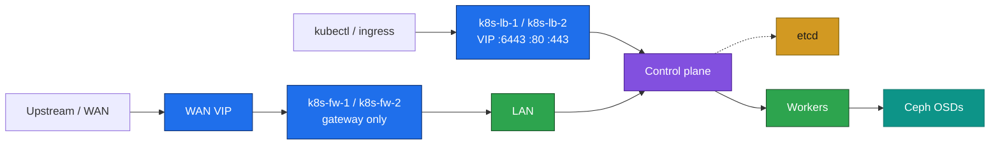
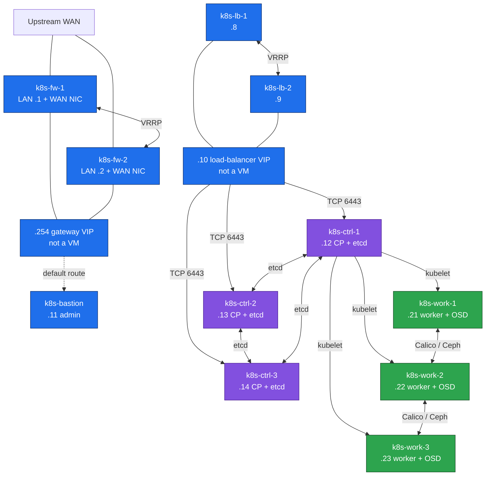

# 01. Inventory and network

**Goal:** VM list, resource budget, and the LAN plan for whichever profile and scenario you are deploying.

> VM creation is out of scope ([00-overview.md](00-overview.md)). These tables are what the VMs look like once they exist.

## One server, four scenarios

The cluster runs on the KVM host below. It has 125 GiB of usable RAM and no swap. The 32 GB machine is not a deploy target. Only one cluster is powered on at a time, so the four scenarios do not add together. Debian 13 first, then Ubuntu 26, on that same server, still one at a time.

Guest RAM has to stay inside those 125 GiB, with room left for KVM. Stacked keeps etcd inside three 8 GB control planes (24 GB for that tier). External moves etcd onto three 4 GB VMs and keeps two 8 GB apiservers (28 GB for that tier). More machines, more RAM. External plus the GPU worker is the largest, at 126 GB.

## KVM host

One KVM server runs every VM. Measured on that host (Ryzen 9 3900X). Usable RAM is what `free` reports, not the sticker on the modules. Partition sizes are what `lsblk` reports. This table has no OSD disk: Ceph's disks are extra disks on the worker VMs.

| Resource | KVM host |
|---|---|
| Servers | 1 |
| CPU | AMD Ryzen 9 3900X, 12 cores, 24 threads. AMD-V. Boost is off. |
| RAM | 125 GiB usable. No swap. |
| OS disk | Samsung 850 EVO 250GB. 32G on `/`, 192G on `/data-root`. |
| Second disk | Samsung 970 EVO Plus 250GB. 192G on `/data-root/sssd`. |
| Third disk | Samsung 970 EVO Plus 1TB. 888G on `/data-root/lssd`. |
| Clusters powered on | 1 |

A single host cannot provide redundancy or failover. There is no second server to take over. If this machine loses power, crashes, or a disk fails, every VM stops and the cluster is down. Keepalived does not help in that case, because both members of a pair are on the same host.

The host can still provide fault tolerance for a VM, while the host itself stays up. One firewall VM can die and the other keeps the gateway. One API proxy can die and the other keeps `10.0.1.10`. One control plane or one etcd member can die and the cluster still has quorum. One storage worker can die and Ceph still has two OSDs and two monitors. That is tolerance of a guest failure, not failover of the server.

Guest vCPU stays under 22 on every scenario, so the host keeps threads of its own. A 50% CPU share would allow up to 44 vCPUs. This lab does not use that. Guest RAM is planned in GB and must be read against 125 GiB usable, with no swap. 126 GB of guests does not fit. The 200 GB Ceph disks are on `k8s-work-1/2/3` only. They are files or volumes on these SSDs, not a fourth disk in this table. The GPU VM has no OSD.

Rollout: [README.md](README.md#rollout-plan).

LAN addresses here are **examples**. Use your own when you provision. Do not commit site WAN or LAN addresses into this repo. Each firewall has a second NIC on WAN; WAN addresses stay off these tables.

## Network

- **Gateway:** `k8s-fw-1` / `k8s-fw-2`, keepalived only, LAN VIP `10.0.1.254`. Every node defaults through this address. No HAProxy here. [03-firewall.md](03-firewall.md).
- **Load balancer:** `k8s-lb-1` / `k8s-lb-2`, keepalived + HAProxy, VIP `10.0.1.10`. Clients use it for the API (`:6443`) and, after ingress, for `:80`/`:443`. Own VRID, different from the firewall LAN VRID. Node-to-node traffic does not pass through this pair. [05-deploy-kubernetes.md](05-deploy-kubernetes.md).
- **Bastion** `10.0.1.11`: jump host, Nexus, Prometheus, Grafana, `kubectl`, Helm. One VM is normal for this role. No HAProxy and no VIP on it.
- **DNS:** static `/etc/hosts` on every node ([02-prepare.md](02-prepare.md)). No cluster DNS server for node names.
- **Kubernetes ranges** (must not overlap the LAN): pod CIDR `192.168.0.0/16`, service CIDR `10.96.0.0/12`.
- **Ports:** `6443` (apiserver, via the API VIP), `80`/`443` (ingress, same VIP, added in [07-ingress.md](07-ingress.md)), `8081`/`8082` (Nexus), `2379-2380` (etcd), `10250` (kubelet), `179`/`4789` (Calico), `9100` (node_exporter), `9090`/`3000` (Prometheus/Grafana on the bastion). VRRP is protocol 112, once for the firewall pair and once for the API pair.
- First Nexus fill goes out through the firewall NAT. After [04-bastion.md](04-bastion.md), apt and image pulls can use the bastion cache.

The bastion is on the LAN and is not drawn above: it is not on the gateway path or the API path.

### VMs and connections — stacked

Eleven VMs. Addresses are the example LAN. External etcd drops `k8s-ctrl-3` and adds `k8s-etcd-1/2/3` (`.15`–`.17`). GPU adds `k8s-work-4` (`.24`).

Every box except the two VIPs is a VM. Both firewalls have a WAN NIC and a LAN NIC. Every other VM has one LAN NIC on `10.0.1.0/24` and uses `.254` as its default gateway. `k8s-bastion` is on that LAN for SSH, Nexus, and metrics only — no line to the API VIP. After ingress, the same `.10` VIP also accepts TCP 80 and 443 and HAProxy sends those to the workers.

## VM resources

One row per VM type. The scenario tables below repeat these sizes with names and example addresses.

| VM | vCPU | RAM | Root | Ceph OSD | Where it appears |
|---|---|---|---|---|---|
| k8s-fw-1, k8s-fw-2 | 1 | 2 GB | 20 GB | — | All four scenarios |
| k8s-lb-1, k8s-lb-2 | 1 | 1 GB | 10 GB | — | All four scenarios |
| k8s-bastion | 1 | 4 GB | 40 GB | — | All four scenarios |
| k8s-ctrl (stacked, etcd on the node) | 2 | 8 GB | 30 GB | — | Scenarios 1 and 2, three nodes |
| k8s-ctrl (external, no etcd) | 2 | 8 GB | 30 GB | — | Scenarios 3 and 4, two nodes |
| k8s-etcd | 1 | 4 GB | 20 GB | — | Scenarios 3 and 4, three nodes |
| k8s-work-1/2/3 | 2 | 24 GB | 20 GB | 200 GB | All four scenarios |
| k8s-work-4 (GPU) | 1 | 16 GB | 20 GB | — | Scenarios 2 and 4 only. Not a Ceph node. |

Scenario totals. Only one row is powered on at a time. RAM left is 125 GiB minus the guest total.

| Scenario | VMs | vCPU | Guest RAM | Root | Ceph OSD | Of 125 GiB |
|---|---|---|---|---|---|---|
| 1. Stacked | 11 | 17 | 106 GB | 250 GB | 600 GB | 19 GiB left |
| 2. Stacked + GPU | 12 | 18 | 122 GB | 270 GB | 600 GB | 3 GiB left |
| 3. External etcd | 13 | 18 | 110 GB | 280 GB | 600 GB | 15 GiB left |
| 4. External etcd + GPU | 14 | 19 | 126 GB | 300 GB | 600 GB | does not fit |

## Where each scenario lands

VM root disks are image files on the two 192G volumes together (`/data-root` and `/data-root/sssd`, 384G). Do not put them on the 32G `/`. The three 200 GB Ceph disks are image files on the 888G volume (`/data-root/lssd`). The GPU VM has no Ceph disk. Only one scenario is on disk at a time.

| Scenario | vCPU of 24 | RAM of 125 GiB | Root disks on 384G | Ceph disks on 888G |
|---|---|---|---|---|
| 1. Stacked | 17, 7 threads left | 106 GB, 19 GiB left | 250 GB, fits | 600 GB, fits |
| 2. Stacked + GPU | 18, 6 threads left | 122 GB, 3 GiB left | 270 GB, fits | 600 GB, fits |
| 3. External etcd | 18, 6 threads left | 110 GB, 15 GiB left | 280 GB, fits | 600 GB, fits |
| 4. External etcd + GPU | 19, 5 threads left | 126 GB, over by about 1 GiB | 300 GB, fits | 600 GB, fits |

Scenario 2's 3 GiB is what KVM itself needs for twelve VMs, so that row has no spare RAM. Scenario 4 does not fit in memory. Guest vCPU stays under 22, so the host keeps at least 5 threads. Putting root disks and Ceph disks on the 888G volume together does not fit scenarios 2 and 4 (870G and 900G against 888G), which is why they are split across the disks above.

## 1. Stacked etcd

| # | VM Name | Role | LAN IP (example) | vCPU | RAM | Root Disk | Ceph OSD |
|---|---|---|---|---|---|---|---|
| 01 | k8s-fw-1 | Firewall (WAN + LAN) | 10.0.1.1 | 1 | 2 GB | 20 GB | - |
| 02 | k8s-fw-2 | Firewall (WAN + LAN) | 10.0.1.2 | 1 | 2 GB | 20 GB | - |
| 03 | k8s-lb-1 | API HAProxy (VRRP master) | 10.0.1.8 | 1 | 1 GB | 10 GB | - |
| 04 | k8s-lb-2 | API HAProxy (VRRP backup) | 10.0.1.9 | 1 | 1 GB | 10 GB | - |
| 05 | k8s-bastion | Jump / kubectl + Helm / Nexus / Prometheus / Grafana | 10.0.1.11 | 1 | 4 GB | 40 GB | - |
| 06 | k8s-ctrl-1 | Control Plane + etcd | 10.0.1.12 | 2 | 8 GB | 30 GB | - |
| 07 | k8s-ctrl-2 | Control Plane + etcd | 10.0.1.13 | 2 | 8 GB | 30 GB | - |
| 08 | k8s-ctrl-3 | Control Plane + etcd | 10.0.1.14 | 2 | 8 GB | 30 GB | - |
| 09 | k8s-work-1 | Worker / Storage | 10.0.1.21 | 2 | 24 GB | 20 GB | 200 GB |
| 10 | k8s-work-2 | Worker / Storage | 10.0.1.22 | 2 | 24 GB | 20 GB | 200 GB |
| 11 | k8s-work-3 | Worker / Storage | 10.0.1.23 | 2 | 24 GB | 20 GB | 200 GB |
| | **VM TOTALS (11 VMs)** | | | **17** | **106 GB** | **250 GB** | **600 GB** |

106 GB leaves 19 GiB of the 125 GiB for the host. No HAProxy on the bastion. Its 40 GB disk is the Nexus blob store. Gateway VIP `10.0.1.254` and API VIP `10.0.1.10` are not VMs.

## 2. Stacked etcd + GPU

Same eleven VMs. `k8s-work-4` is 16 GB and has no Ceph disk. At 24 GB this scenario was 130 GB and did not fit.

| # | VM Name | Role | LAN IP (example) | vCPU | RAM | Root Disk | Ceph OSD |
|---|---|---|---|---|---|---|---|
| 12 | k8s-work-4 | Worker / GPU | 10.0.1.24 | 1 | 16 GB | 20 GB | — |
| | **VM TOTALS (12 VMs)** | | | **18** | **122 GB** | **270 GB** | **600 GB** |

122 GB leaves 3 GiB of the 125 GiB. That is the edge of what KVM needs for twelve VMs. Driver and device plugin: [14-gpu.md](14-gpu.md).

## 3. External etcd

Control plane drops to 2 nodes. etcd moves to 3 smaller VMs. Apiserver is stateless; only etcd needs an odd count ([00-overview.md](00-overview.md#scenarios)).

| # | VM Name | Role | LAN IP (example) | vCPU | RAM | Root Disk | Ceph OSD |
|---|---|---|---|---|---|---|---|
| 01 | k8s-fw-1 | Firewall (WAN + LAN) | 10.0.1.1 | 1 | 2 GB | 20 GB | - |
| 02 | k8s-fw-2 | Firewall (WAN + LAN) | 10.0.1.2 | 1 | 2 GB | 20 GB | - |
| 03 | k8s-lb-1 | API HAProxy (VRRP master) | 10.0.1.8 | 1 | 1 GB | 10 GB | - |
| 04 | k8s-lb-2 | API HAProxy (VRRP backup) | 10.0.1.9 | 1 | 1 GB | 10 GB | - |
| 05 | k8s-bastion | Jump / kubectl + Helm / Nexus / Prometheus / Grafana | 10.0.1.11 | 1 | 4 GB | 40 GB | - |
| 06 | k8s-ctrl-1 | Control Plane | 10.0.1.12 | 2 | 8 GB | 30 GB | - |
| 07 | k8s-ctrl-2 | Control Plane | 10.0.1.13 | 2 | 8 GB | 30 GB | - |
| 08 | k8s-etcd-1 | etcd | 10.0.1.15 | 1 | 4 GB | 20 GB | - |
| 09 | k8s-etcd-2 | etcd | 10.0.1.16 | 1 | 4 GB | 20 GB | - |
| 10 | k8s-etcd-3 | etcd | 10.0.1.17 | 1 | 4 GB | 20 GB | - |
| 11 | k8s-work-1 | Worker / Storage | 10.0.1.21 | 2 | 24 GB | 20 GB | 200 GB |
| 12 | k8s-work-2 | Worker / Storage | 10.0.1.22 | 2 | 24 GB | 20 GB | 200 GB |
| 13 | k8s-work-3 | Worker / Storage | 10.0.1.23 | 2 | 24 GB | 20 GB | 200 GB |
| | **VM TOTALS (13 VMs)** | | | **18** | **110 GB** | **280 GB** | **600 GB** |

110 GB leaves 15 GiB of the 125 GiB for the host. The etcd tier is 3 × 4 GB. That is more RAM than the etcd slice inside the three stacked control planes, which is why this scenario costs more than stacked even though two apiservers replace three.

## 4. External etcd + GPU

Same as scenario 3, plus the same 16 GB GPU worker. It does not join Ceph.

| # | VM Name | Role | LAN IP (example) | vCPU | RAM | Root Disk | Ceph OSD |
|---|---|---|---|---|---|---|---|
| 14 | k8s-work-4 | Worker / GPU | 10.0.1.24 | 1 | 16 GB | 20 GB | — |
| | **VM TOTALS (14 VMs)** | | | **19** | **126 GB** | **300 GB** | **600 GB** |

126 GB does not fit in 125 GiB. Do not start this scenario until the guest total is lower.

## Prerequisites
- [00-overview.md](00-overview.md)

## Next
- [02-prepare.md](02-prepare.md)
