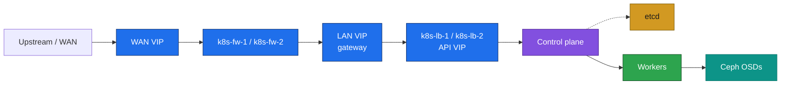

# 01. Inventory and network

**Goal:** VM list, resource budget, and the LAN plan for whichever profile and scenario you are deploying.

> VM creation is out of scope ([00-overview.md](00-overview.md)). These tables are what the VMs look like once they exist.

## Three independent lab environments

**Light**, **Heavy**, and **GPU** are separate clusters. They reuse `10.0.1.0/24`, so only one is on a given L2 at a time. Do not join a Light node to a Heavy or GPU cluster.

- **Light** (laptop) — 50% CPU cap, smaller nodes. Deploy this one first.
- **Heavy** (server) — same shape, larger nodes.
- **GPU** (server) — Heavy plus `k8s-work-4`.

Rollout: [README.md](README.md#rollout-plan).

LAN addresses here are **examples**. Use your own when you provision. Do not commit site WAN or LAN addresses into this repo. Each firewall has a second NIC on WAN; WAN addresses stay off these tables.

## Network

- **Gateway:** `k8s-fw-1` / `k8s-fw-2`, keepalived, LAN VIP `10.0.1.254` (default gateway). VRID is per lab instance. [03-firewall.md](03-firewall.md).
- **API:** `k8s-lb-1` / `k8s-lb-2`, keepalived + HAProxy, API VIP `10.0.1.10:6443`. Own VRID, different from the firewall's LAN VRID (same L2). [05-deploy-kubernetes.md](05-deploy-kubernetes.md).
- **Bastion** `10.0.1.11`: jump host, Nexus, Prometheus, Grafana, `kubectl`, Helm. No API VIP on this VM.
- **DNS:** static `/etc/hosts` on every node ([02-prepare.md](02-prepare.md)). No cluster DNS server for node names.
- **Kubernetes ranges** (must not overlap the LAN): pod CIDR `192.168.0.0/16`, service CIDR `10.96.0.0/12`.
- **Ports:** `6443` (apiserver, via the API VIP), `80`/`443` (ingress, same VIP, added in [08-ingress.md](08-ingress.md)), `8081`/`8082` (Nexus), `2379-2380` (etcd), `10250` (kubelet), `179`/`4789` (Calico), `9100` (node_exporter), `9090`/`3000` (Prometheus/Grafana on the bastion). VRRP is protocol 112, once for the firewall pair and once for the API pair.
- First Nexus fill goes out through the firewall NAT. After [04-bastion.md](04-bastion.md), apt and image pulls can use the bastion cache.

The bastion sits on the LAN beside the API pair. It is not on the API path.

## Laptop — Light profile

Host budget: 50% CPU share. Adjust to the machine you actually have.

The API pair is two small VMs (1 vCPU / 1 GB / 10 GB). On this laptop that drops host RAM reserve from 6 GB to 4 GB for stacked, and to none for external.

### Scenario A — Stacked etcd

| # | VM Name | Role | LAN IP (example) | vCPU | RAM | Root Disk | Ceph OSD |
|---|---|---|---|---|---|---|---|
| 01 | k8s-fw-1 | Firewall (WAN + LAN) | 10.0.1.1 | 2 | 2 GB | 20 GB | - |
| 02 | k8s-fw-2 | Firewall (WAN + LAN) | 10.0.1.2 | 2 | 2 GB | 20 GB | - |
| 03 | k8s-lb-1 | API HAProxy (VRRP master) | 10.0.1.8 | 1 | 1 GB | 10 GB | - |
| 04 | k8s-lb-2 | API HAProxy (VRRP backup) | 10.0.1.9 | 1 | 1 GB | 10 GB | - |
| 05 | k8s-bastion | Jump / kubectl + Helm / Nexus / Prometheus / Grafana | 10.0.1.11 | 2 | 4 GB | 40 GB | - |
| 06 | k8s-ctrl-1 | Control Plane + etcd | 10.0.1.12 | 2 | 2 GB | 30 GB | - |
| 07 | k8s-ctrl-2 | Control Plane + etcd | 10.0.1.13 | 2 | 2 GB | 30 GB | - |
| 08 | k8s-ctrl-3 | Control Plane + etcd | 10.0.1.14 | 2 | 2 GB | 30 GB | - |
| 09 | k8s-work-1 | Worker / Storage | 10.0.1.21 | 4 | 4 GB | 20 GB | 40 GB |
| 10 | k8s-work-2 | Worker / Storage | 10.0.1.22 | 4 | 4 GB | 20 GB | 40 GB |
| 11 | k8s-work-3 | Worker / Storage | 10.0.1.23 | 4 | 4 GB | 20 GB | 40 GB |
| | **VM TOTALS (11 VMs)** | | | **26** | **28 GB** | **250 GB** | **120 GB** |
| | **HOST RESERVED** | | | **2** | **4 GB** | — | — |
| | **PC TOTALS** | | | **12** | **32 GB** | **1 TB** | — |

Gateway VIP `10.0.1.254` and API VIP `10.0.1.10` are not VMs.

- **RAM** still caps at 32 GB: 28 GB of VMs + 4 GB for the host.
- **vCPU** oversubscribes (26 allocated on a 12-vCPU, 50%-capped share). RAM does not oversubscribe.
- **Disk:** root 250 GB + Ceph OSD 120 GB = 370 GB of the 1 TB disk.
- Bastion root is 40 GB for the Nexus blob store ([04-bastion.md](04-bastion.md)).

### Scenario B — External etcd

Control plane drops to 2 nodes. etcd moves to 3 VMs. Apiserver is stateless; only etcd needs an odd count ([00-overview.md](00-overview.md#scenarios)).

| # | VM Name | Role | LAN IP (example) | vCPU | RAM | Root Disk | Ceph OSD |
|---|---|---|---|---|---|---|---|
| 01 | k8s-fw-1 | Firewall (WAN + LAN) | 10.0.1.1 | 2 | 2 GB | 20 GB | - |
| 02 | k8s-fw-2 | Firewall (WAN + LAN) | 10.0.1.2 | 2 | 2 GB | 20 GB | - |
| 03 | k8s-lb-1 | API HAProxy (VRRP master) | 10.0.1.8 | 1 | 1 GB | 10 GB | - |
| 04 | k8s-lb-2 | API HAProxy (VRRP backup) | 10.0.1.9 | 1 | 1 GB | 10 GB | - |
| 05 | k8s-bastion | Jump / kubectl + Helm / Nexus / Prometheus / Grafana | 10.0.1.11 | 2 | 4 GB | 40 GB | - |
| 06 | k8s-ctrl-1 | Control Plane | 10.0.1.12 | 2 | 2 GB | 30 GB | - |
| 07 | k8s-ctrl-2 | Control Plane | 10.0.1.13 | 2 | 2 GB | 30 GB | - |
| 08 | k8s-etcd-1 | etcd | 10.0.1.15 | 1 | 2 GB | 20 GB | - |
| 09 | k8s-etcd-2 | etcd | 10.0.1.16 | 1 | 2 GB | 20 GB | - |
| 10 | k8s-etcd-3 | etcd | 10.0.1.17 | 1 | 2 GB | 20 GB | - |
| 11 | k8s-work-1 | Worker / Storage | 10.0.1.21 | 4 | 4 GB | 20 GB | 40 GB |
| 12 | k8s-work-2 | Worker / Storage | 10.0.1.22 | 4 | 4 GB | 20 GB | 40 GB |
| 13 | k8s-work-3 | Worker / Storage | 10.0.1.23 | 4 | 4 GB | 20 GB | 40 GB |
| | **VM TOTALS (13 VMs)** | | | **27** | **32 GB** | **280 GB** | **120 GB** |
| | **HOST RESERVED** | | | **2** | **0 GB** | — | — |
| | **PC TOTALS** | | | **12** | **32 GB** | **1 TB** | — |

External Light fills the 32 GB laptop. No RAM left for the host. Run it only when nothing else is using that machine. Stacked is the laptop default.

## Server — Heavy and GPU

Host budget as previously sized: 24 vCPU, 128 GB RAM, 250 GB NVMe for root disks, 1 TB NVMe for Ceph. The API pair adds 2 vCPU, 2 GB, and 20 GB of root on every server table. GPU stacked therefore wants 130 GB RAM and 270 GB of root NVMe; a chassis that is still 128 GB / 250 GB root is 2 GB of RAM and 20 GB of disk short. vCPU oversubscribe on GPU stacked goes from 2 to 4.

### Heavy — Scenario A (Stacked etcd)

| # | VM Name | Role | LAN IP (example) | vCPU | RAM | Root Disk | Ceph OSD |
|---|---|---|---|---|---|---|---|
| 01 | k8s-fw-1 | Firewall (WAN + LAN) | 10.0.1.1 | 2 | 2 GB | 20 GB | - |
| 02 | k8s-fw-2 | Firewall (WAN + LAN) | 10.0.1.2 | 2 | 2 GB | 20 GB | - |
| 03 | k8s-lb-1 | API HAProxy (VRRP master) | 10.0.1.8 | 1 | 1 GB | 10 GB | - |
| 04 | k8s-lb-2 | API HAProxy (VRRP backup) | 10.0.1.9 | 1 | 1 GB | 10 GB | - |
| 05 | k8s-bastion | Jump / kubectl + Helm / Nexus / Prometheus / Grafana | 10.0.1.11 | 2 | 4 GB | 40 GB | - |
| 06 | k8s-ctrl-1 | Control Plane + etcd | 10.0.1.12 | 2 | 8 GB | 30 GB | - |
| 07 | k8s-ctrl-2 | Control Plane + etcd | 10.0.1.13 | 2 | 8 GB | 30 GB | - |
| 08 | k8s-ctrl-3 | Control Plane + etcd | 10.0.1.14 | 2 | 8 GB | 30 GB | - |
| 09 | k8s-work-1 | Worker / Storage | 10.0.1.21 | 4 | 24 GB | 20 GB | 200 GB |
| 10 | k8s-work-2 | Worker / Storage | 10.0.1.22 | 4 | 24 GB | 20 GB | 200 GB |
| 11 | k8s-work-3 | Worker / Storage | 10.0.1.23 | 4 | 24 GB | 20 GB | 200 GB |
| | **VM TOTALS (11 VMs)** | | | **26** | **106 GB** | **250 GB** | **600 GB** |

Same bastion role as Light. Root disk 40 GB is the Nexus blob store.

### GPU — Scenario A (Heavy + GPU worker)

Everything in Heavy above, plus:

| # | VM Name | Role | LAN IP (example) | vCPU | RAM | Root Disk | Ceph OSD |
|---|---|---|---|---|---|---|---|
| 12 | k8s-work-4 | Worker / Storage / GPU (NVIDIA) | 10.0.1.24 | 2 | 24 GB | 20 GB | 200 GB |
| | **VM TOTALS (12 VMs)** | | | **28** | **130 GB** | **270 GB** | **800 GB** |
| | **PC AS PREVIOUSLY STATED** | | | **24** | **128 GB** | **250 GB** | **1 TB** |

`k8s-work-4` is a VM with the GPU passed through. Hypervisor IOMMU setup is out of scope. The node is tainted. Driver and device plugin: [13-gpu.md](13-gpu.md).

### Heavy/GPU — Scenario B (External etcd)

| # | VM Name | Role | LAN IP (example) | vCPU | RAM | Root Disk | Ceph OSD |
|---|---|---|---|---|---|---|---|
| 01 | k8s-fw-1 | Firewall (WAN + LAN) | 10.0.1.1 | 2 | 2 GB | 20 GB | - |
| 02 | k8s-fw-2 | Firewall (WAN + LAN) | 10.0.1.2 | 2 | 2 GB | 20 GB | - |
| 03 | k8s-lb-1 | API HAProxy (VRRP master) | 10.0.1.8 | 1 | 1 GB | 10 GB | - |
| 04 | k8s-lb-2 | API HAProxy (VRRP backup) | 10.0.1.9 | 1 | 1 GB | 10 GB | - |
| 05 | k8s-bastion | Jump / kubectl + Helm / Nexus / Prometheus / Grafana | 10.0.1.11 | 2 | 4 GB | 40 GB | - |
| 06 | k8s-ctrl-1 | Control Plane | 10.0.1.12 | 2 | 8 GB | 30 GB | - |
| 07 | k8s-ctrl-2 | Control Plane | 10.0.1.13 | 2 | 8 GB | 30 GB | - |
| 08 | k8s-etcd-1 | etcd | 10.0.1.15 | 1 | 2 GB | 10 GB | - |
| 09 | k8s-etcd-2 | etcd | 10.0.1.16 | 1 | 2 GB | 10 GB | - |
| 10 | k8s-etcd-3 | etcd | 10.0.1.17 | 1 | 2 GB | 10 GB | - |
| 11 | k8s-work-1 | Worker / Storage | 10.0.1.21 | 4 | 24 GB | 20 GB | 200 GB |
| 12 | k8s-work-2 | Worker / Storage | 10.0.1.22 | 4 | 24 GB | 20 GB | 200 GB |
| 13 | k8s-work-3 | Worker / Storage | 10.0.1.23 | 4 | 24 GB | 20 GB | 200 GB |
| 14 | k8s-work-4 | Worker / Storage / GPU (NVIDIA) | 10.0.1.24 | 2 | 24 GB | 20 GB | 200 GB |
| | **VM TOTALS (14 VMs)** | | | **29** | **128 GB** | **270 GB** | **800 GB** |
| | **PC AS PREVIOUSLY STATED** | | | **24** | **128 GB** | **250 GB** | **1 TB** |

RAM matches 128 GB with nothing reserved. Root disks need 270 GB, 20 GB past the 250 GB NVMe. Drop `k8s-work-4` for a Heavy-only external cluster (27 vCPU / 104 GB / 250 GB root / 600 GB OSD).

etcd nodes stay 1 vCPU / 2 GB / 10 GB: at this size etcd is disk and network sensitive, not CPU hungry.

## Prerequisites
- [00-overview.md](00-overview.md)

## Next
- [02-prepare.md](02-prepare.md)
