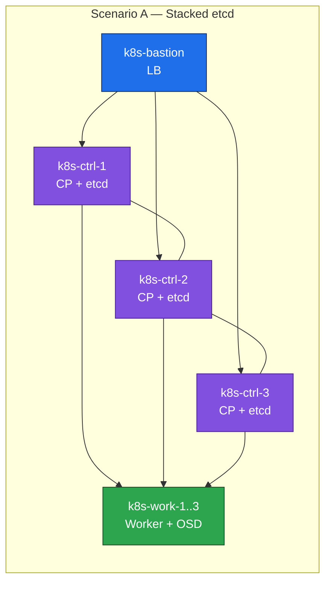
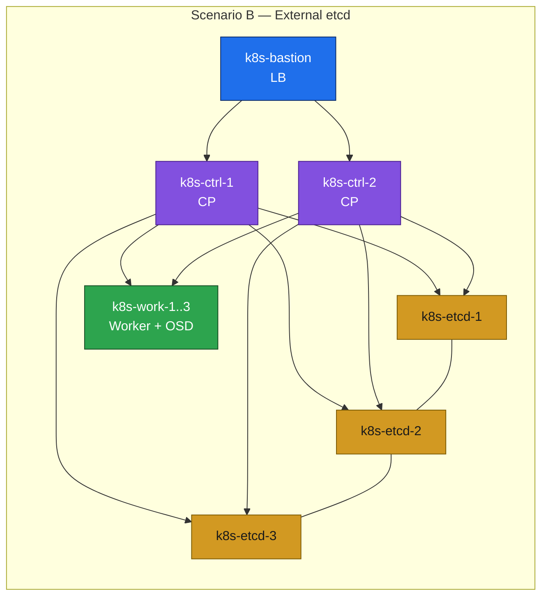

# 01. Deployment Scenarios

**Goal:** Pick a control-plane/etcd topology before provisioning VMs, since it changes the node count and the bootstrap steps you'll follow later.

Each scenario has its own directory under every profile — `stacked-etcd/` for Scenario A, `external-etcd/` for Scenario B (see [README.md](README.md#layout)). The two names are interchangeable throughout this repo.

## Scenario A — Stacked etcd (`stacked-etcd/`)
- etcd runs co-located on each control-plane node (standard `kubeadm` HA topology).
- 3 control-plane nodes (odd count, required for etcd quorum).
- Simpler: fewer VMs, one bootstrap path, etcd and apiserver fail together per node.
- Bootstrap doc: `08-bootstrap.md` in whichever profile's `stacked-etcd/` directory you're deploying, e.g. [1-light-laptop/stacked-etcd/08-bootstrap.md](1-light-laptop/stacked-etcd/08-bootstrap.md).

## Scenario B — External (dedicated) etcd (`external-etcd/`)
- etcd runs on its own VMs, independent of the control-plane nodes.
- 3 dedicated etcd nodes (odd count, still required for quorum) + 2 control-plane nodes (apiserver is stateless, so it doesn't need quorum and can run on fewer nodes).
- More VMs and moving parts, but control-plane and etcd fail independently, and each can be scaled/replaced on its own.
- Bootstrap doc: `08-bootstrap.md` in whichever profile's `external-etcd/` directory you're deploying, e.g. [1-light-laptop/external-etcd/08-bootstrap.md](1-light-laptop/external-etcd/08-bootstrap.md).

## Topology diagrams

Color key: 🔵 bastion/LB, 🟣 control plane, 🟠 etcd, 🟢 worker. Same palette as every other diagram in this repo — see [00-overview.md](00-overview.md#diagram-color-legend).

## Trade-off summary

| | Scenario A (stacked) | Scenario B (external etcd) |
|---|---|---|
| Control-plane VMs | 3 | 2 |
| Dedicated etcd VMs | 0 | 3 |
| Total control-plane + etcd VMs | 3 | 5 |
| Failure isolation (etcd vs apiserver) | Coupled | Independent |
| Operational complexity | Lower | Higher |

## Prerequisites
- [00-overview.md](00-overview.md)

## Next
- Node inventory and resource budget for both scenarios: [02-hardware-inventory.md](02-hardware-inventory.md)
