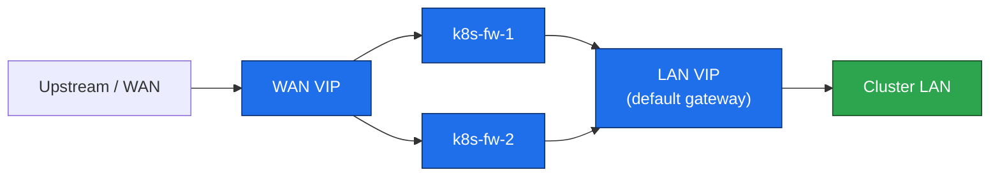

# 03. Firewall pair

**Goal:** Put a two-node keepalived firewall in front of the LAN so the cluster has a redundant default gateway and a single WAN entry. The API VIP (`10.0.1.10`) is a second keepalived pair, `k8s-lb-1` / `k8s-lb-2`, in [05-deploy-kubernetes.md](05-deploy-kubernetes.md). Do not put that VIP on these firewalls, and do not reuse this VRID for it — both pairs speak VRRP on the same LAN.

**Applies to:** `k8s-fw-1` and `k8s-fw-2` only. Not a Kubernetes node — no kubelet, no containerd.

WAN addresses, WAN VIP, and VRID are **site-local**. This file uses variables. Do not copy a production/lab WAN numbering plan into the repo.

```sh
WAN_IF=eth0                 # NIC that faces upstream
LAN_IF=eth1                 # NIC on the cluster LAN
WAN_VIP="<your WAN VIP>"    # site address, not stored in this repo
LAN_VIP=10.0.1.254          # example gateway; use yours if it differs
VRID=60                     # firewall VRID; the API pair must use a different one
```

`k8s-fw-1` is MASTER (priority 100), `k8s-fw-2` is BACKUP (priority 90). Same `VRID` on both instances is fine because they run on different interfaces.

## Steps

**1. Enable forwarding** — both firewalls. These VMs are not Kubernetes nodes. Read the live value, write the boot file, then load that file.
```sh
sysctl -n net.ipv4.ip_forward
sysctl -n net.ipv4.conf.all.forwarding
cat <<EOF | sudo tee /etc/sysctl.d/k8s-fw.conf       # survives reboot
net.ipv4.ip_forward = 1
net.ipv4.conf.all.forwarding = 1
EOF
sudo sysctl --system                                 # apply the file, not a one-shot sysctl -w
sysctl -n net.ipv4.ip_forward                        # must print 1
```

**2. Install pinned keepalived** — same version on both nodes, then freeze it.
```sh
sudo apt update
apt-cache madison keepalived                              # copy one version string
KEEPALIVED_VERSION="<version from the list above>"
sudo apt install -y keepalived=${KEEPALIVED_VERSION}
sudo apt-mark hold keepalived                             # apt upgrade must not move it
```

**3. Configure keepalived** — `/etc/keepalived/keepalived.conf` on `k8s-fw-1` (MASTER). Substitute interface names and `$WAN_VIP`. Do not put a real passphrase in git; set `auth_pass` locally (8 chars, keepalived truncates anyway):

```
vrrp_instance WAN {
    state MASTER
    interface ${WAN_IF}
    virtual_router_id ${VRID}
    priority 100
    advert_int 1
    authentication {
        auth_type PASS
        auth_pass <local-only>
    }
    virtual_ipaddress {
        ${WAN_VIP}
    }
}

vrrp_instance LAN {
    state MASTER
    interface ${LAN_IF}
    virtual_router_id ${VRID}
    priority 100
    advert_int 1
    authentication {
        auth_type PASS
        auth_pass <local-only>
    }
    virtual_ipaddress {
        10.0.1.254/24
    }
}
```

On `k8s-fw-2`: same file with `state BACKUP` and `priority 90` in both instances. Then:

```sh
sudo systemctl enable --now keepalived   # start VRRP and start it on boot
ip -br addr show                         # MASTER shows both VIPs; BACKUP does not
```

**4. Forward LAN → WAN** — both nodes. This is lab NAT, not a hardened edge. Write `/etc/nftables.conf` and let the service load it. Do not `nft add` into the running ruleset and hope a later reboot keeps it. Docker stays off these VMs.
```sh
sudo nft list ruleset || true                                                                         # read what is loaded now
sudo apt install -y nftables                                                                          # minimal images do not ship nft
sudo tee /etc/nftables.conf <<EOF
#!/usr/sbin/nft -f
flush ruleset
table ip nat {
    chain postrouting {
        type nat hook postrouting priority 100;
        oifname "$WAN_IF" masquerade
    }
}
table ip filter {
    chain forward {
        type filter hook forward priority 0; policy drop;
        ct state established,related accept
        iifname "$LAN_IF" oifname "$WAN_IF" accept
        iifname "$WAN_IF" oifname "$LAN_IF" ct state established,related accept
    }
}
EOF
sudo nft -c -f /etc/nftables.conf                                                                     # syntax check, no change yet
sudo systemctl enable --now nftables                                                                  # boot file becomes the live ruleset
sudo nft list ruleset                                                                                 # masquerade is present
```

**5. Default gateway** — every non-firewall VM, only after step 3 shows the VIP on the MASTER. Read the live route and the saved network config. Write the gateway into that saved config, then reload it. An `ip route replace` alone is gone at the next reboot.
```sh
ip route show default
IFACE=$(ip -br addr show | awk '/10\.0\.1\./ {print $1; exit}')
echo "LAN iface: $IFACE"                                              # stop if this is not the LAN NIC
if systemctl is-active --quiet NetworkManager; then
  nmcli -f NAME,DEVICE connection show                                # pick the LAN connection name
  sudo nmcli connection modify "<connection>" ipv4.gateway 10.0.1.254 ipv4.never-default no
  sudo nmcli connection up "<connection>"                             # apply the saved connection
elif ls /etc/netplan/*.yaml >/dev/null 2>&1; then
  sudo grep -n gateway /etc/netplan/*.yaml || true                    # read before editing
  echo "set gateway 10.0.1.254 under the LAN NIC in that yaml, then:"
  sudo netplan generate && sudo netplan apply
else
  grep -n -E "iface ${IFACE}|gateway" /etc/network/interfaces || true
  sudo sed -i '/^[[:space:]]*gateway /d' /etc/network/interfaces
  sudo sed -i "/^iface ${IFACE} /a \\    gateway 10.0.1.254" /etc/network/interfaces
  grep -n gateway /etc/network/interfaces                            # the line is inside the LAN iface stanza
  sudo systemctl restart networking                                  # load the file; SSH drops for a moment
fi
ip route show default                                                  # via 10.0.1.254
ping -c1 10.0.1.254
curl -sI https://deb.debian.org | head -1                             # Ubuntu: archive.ubuntu.com
```

Failover check: `sudo systemctl stop keepalived` on MASTER; VIPs must appear on BACKUP within a couple of seconds; restore keepalived on MASTER afterward.

## Request path



## Prerequisites
- [02-prepare.md](02-prepare.md)

## Next
- [04-bastion.md](04-bastion.md)
