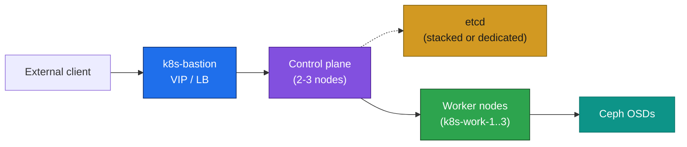

# 03. Network Plan

**Goal:** Define addressing, DNS, and connectivity assumptions used by every later step.

## Covers
- Subnet layout (matches the IPs in [02-hardware-inventory.md](02-hardware-inventory.md))
- Hostname / DNS resolution strategy (static `/etc/hosts` vs. a real DNS server)
- VIP for the apiserver load balancer (used in [07-load-balancer.md](07-load-balancer.md))
- Firewall/port requirements between bastion, control-plane, etcd, and worker nodes
- External connectivity (does the cluster need outbound internet for pulling images?)

## Network diagram

Generic path shared by both scenarios — the etcd tier is dedicated in Scenario B and absent (folded into control plane) in Scenario A; see [01-scenarios.md](01-scenarios.md) for the per-scenario topology.

## Prerequisites
- [02-hardware-inventory.md](02-hardware-inventory.md)

## Next
- [04-prerequisites.md](04-prerequisites.md)
