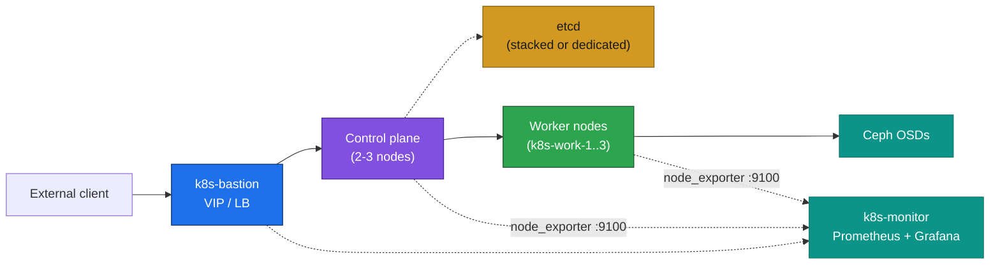

# 03. Network Plan

**Goal:** Define addressing, DNS, and connectivity assumptions used by every later step.

## Covers
- Subnet layout (matches the IPs in [02-hardware-inventory.md](02-hardware-inventory.md)): nodes on `10.0.1.0/24`, `k8s-monitor` at `10.0.1.31` — **reused identically across all three profiles** (Light/Heavy/GPU, see [00-overview.md](00-overview.md#deployment-profiles)), since they're independent lab instances that are never online as the same cluster at the same time
- Hostname / DNS resolution strategy: static `/etc/hosts` on every node (no cluster-internal DNS server for this lab) — populated in each directory's `05-os-baseline.md`, e.g. [1-light-laptop/stacked-etcd/05-os-baseline.md](1-light-laptop/stacked-etcd/05-os-baseline.md)
- apiserver VIP on the bastion (used in each directory's `07-load-balancer.md`, e.g. [1-light-laptop/stacked-etcd/07-load-balancer.md](1-light-laptop/stacked-etcd/07-load-balancer.md)), e.g. `10.0.1.10:6443`
- Kubernetes networking ranges (don't overlap `10.0.1.0/24`): pod CIDR `192.168.0.0/16` (Calico default), service CIDR `10.96.0.0/12` (kubeadm default)
- Ports each node must reach: `6443` (apiserver, via VIP), `2379-2380` (etcd, control-plane/etcd nodes only), `10250` (kubelet), `179`/`4789` (Calico BGP/VXLAN), `9100` (node_exporter → the monitoring host), `9090`/`3000` (Prometheus/Grafana on the monitoring host — `k8s-monitor` on Light, `k8s-bastion` itself on Heavy/GPU, see [02-hardware-inventory.md](02-hardware-inventory.md))
- External connectivity: every node needs outbound internet (or a local mirror) to pull the Debian, Kubernetes, and Ceph apt repos, and to pull container images

## Network diagram

Generic path shared by both scenarios — the etcd tier is dedicated in Scenario B and absent (folded into control plane) in Scenario A; see [01-scenarios.md](01-scenarios.md) for the per-scenario topology.

## Prerequisites
- [02-hardware-inventory.md](02-hardware-inventory.md)

## Next
- Pick a profile and etcd scenario, then start there — e.g. [1-light-laptop/stacked-etcd/04-prerequisites.md](1-light-laptop/stacked-etcd/04-prerequisites.md) or [1-light-laptop/external-etcd/04-prerequisites.md](1-light-laptop/external-etcd/04-prerequisites.md). See [README.md](README.md#layout) for the full directory tree.
