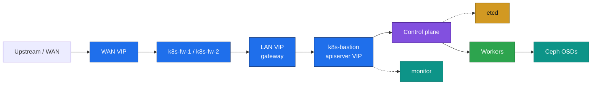

# 03. Network Plan

**Goal:** Define addressing, DNS, and connectivity assumptions used by every later step.

LAN addresses in this repo (`10.0.1.0/24`, VIPs `.10` / `.254`) are **examples**. Map them to your site when you provision. **Do not commit WAN or site-specific LAN addresses into this repository.**

## Covers
- **Edge:** two dual-homed firewall VMs (`k8s-fw-1` / `k8s-fw-2`), keepalived WAN VIP + LAN VIP, one VRID per lab instance — [06-firewall.md](06-firewall.md). Cluster nodes use the LAN VIP as default gateway.
- **LAN (example):** `10.0.1.0/24` for every profile (Light/Heavy/GPU). Profiles are independent instances and must not share a live L2 at the same time.
- **Apiserver VIP:** `10.0.1.10:6443` on `k8s-bastion` HAProxy ([08-load-balancer.md](08-load-balancer.md)) — not the firewall LAN VIP.
- Hostname / DNS: static `/etc/hosts` on every node — [05-os-baseline.md](05-os-baseline.md). No cluster-internal DNS server for this lab.
- Kubernetes ranges (must not overlap the LAN): pod CIDR `192.168.0.0/16` (Calico default), service CIDR `10.96.0.0/12` (kubeadm default)
- Ports on the LAN: `6443` (apiserver, via bastion VIP), `2379-2380` (etcd), `10250` (kubelet), `179`/`4789` (Calico), `9100` (node_exporter), `9090`/`3000` (Prometheus/Grafana on `k8s-monitor` or the bastion). VRRP (protocol 112) between the two firewalls.
- Outbound internet for apt and container images goes **through the firewall pair** (NAT on WAN).

## Network diagram

```mermaid
flowchart LR
    Ext["Upstream / WAN"] --> WANVIP["WAN VIP"]:::bastion
    WANVIP --> FW["k8s-fw-1 / k8s-fw-2"]:::bastion
    FW --> LANVIP["LAN VIP\ngateway"]:::bastion
    LANVIP --> Bastion["k8s-bastion\napiserver VIP"]:::bastion
    Bastion --> CP["Control plane"]:::controlPlane
    CP -.-> Etcd["etcd"]:::etcd
    CP --> Work["Workers"]:::worker
    Work --> Storage["Ceph OSDs"]:::storage
    Bastion -.-> Mon["monitor"]:::storage

    classDef bastion fill:#1f6feb,stroke:#0c2d6b,color:#ffffff
    classDef controlPlane fill:#8250df,stroke:#4b1f91,color:#ffffff
    classDef etcd fill:#d29922,stroke:#7d5c05,color:#1a1a1a
    classDef worker fill:#2da44e,stroke:#164c24,color:#ffffff
    classDef storage fill:#0d9488,stroke:#0f766e,color:#ffffff
```

## Prerequisites
- [02-hardware-inventory.md](02-hardware-inventory.md)

## Next
- Circle a profile × scenario in [02-hardware-inventory.md](02-hardware-inventory.md), then [04-prerequisites.md](04-prerequisites.md). At step 09, open [09-bootstrap-stacked.md](09-bootstrap-stacked.md) or [09-bootstrap-external.md](09-bootstrap-external.md).
