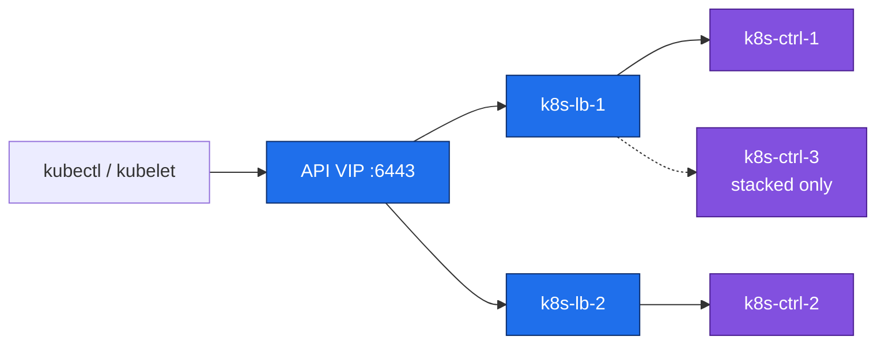
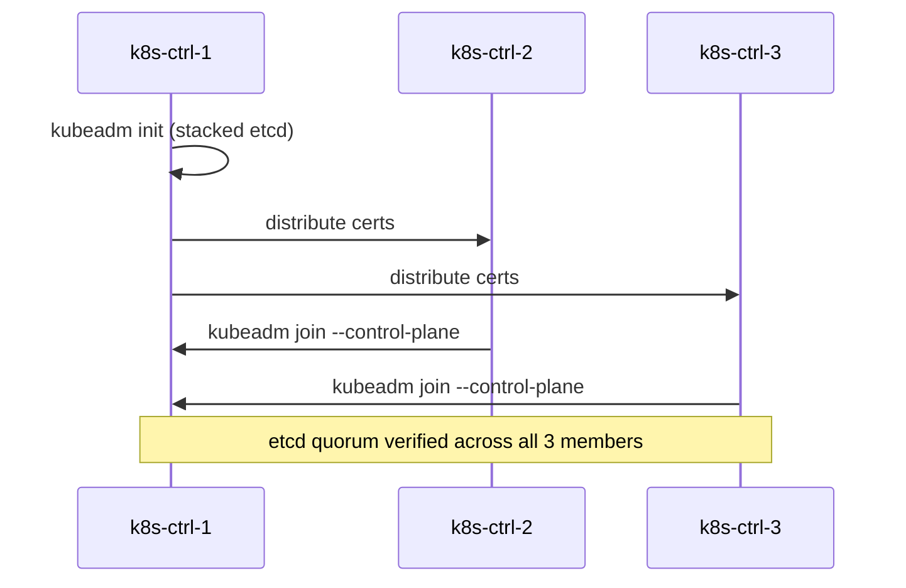
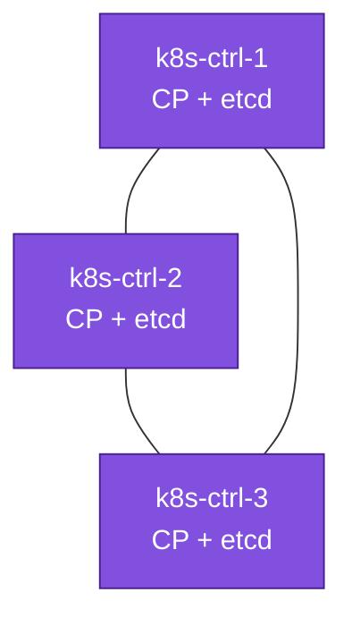
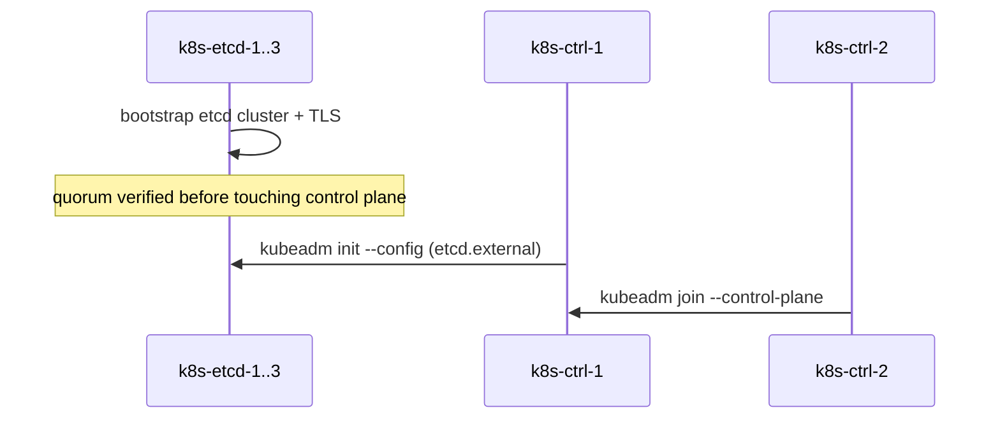
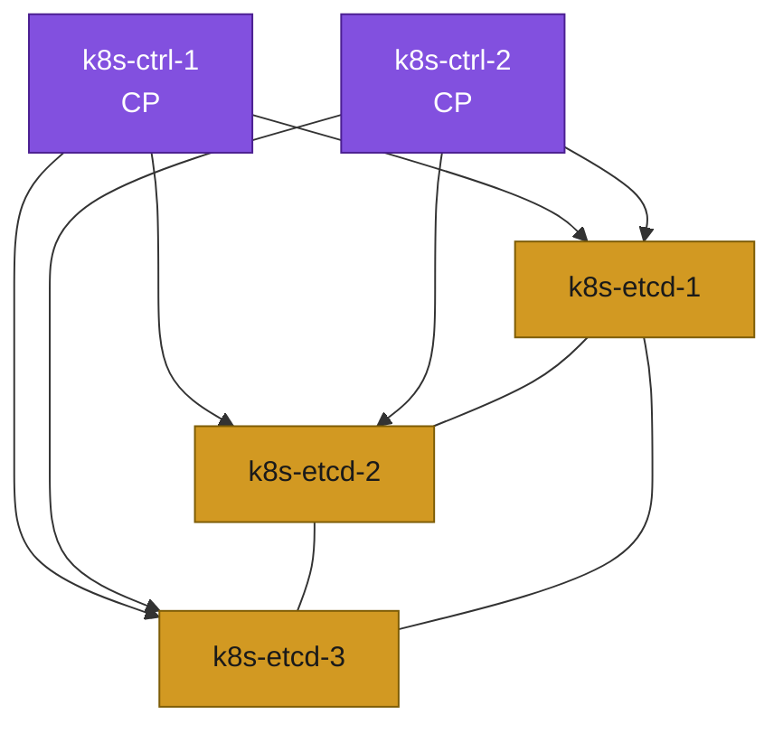
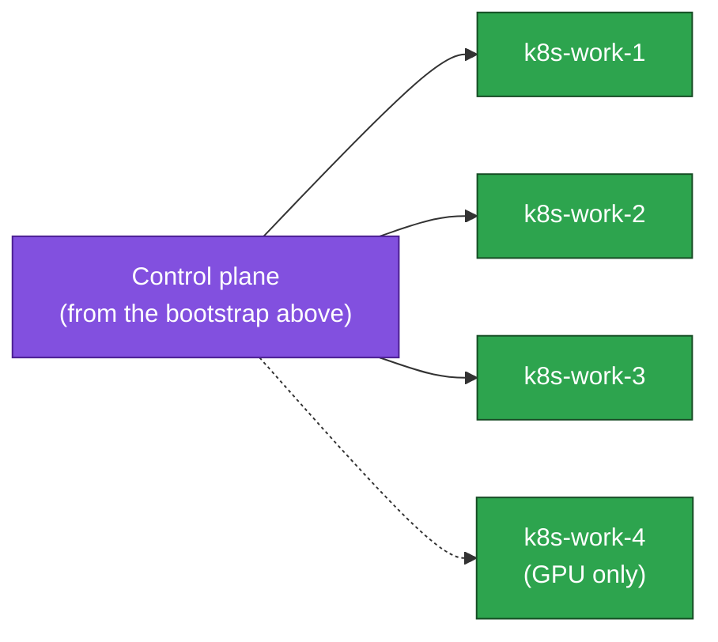

# 05. Deploy Kubernetes

**Goal:** Container runtime on the Kubernetes nodes, a two-node API load balancer, then one control-plane bootstrap (stacked **or** external), worker join, and Calico. `kubectl` and Helm land on the bastion at the end of the bootstrap you opened.

Open **one** bootstrap section. Stacked is the current pass.

## Container runtime

**Goal:** Install and configure the container runtime on control-plane and worker nodes.

## Applies to
Every `k8s-ctrl-*` and `k8s-work-*` in the inventory table you circled in [01-inventory.md](01-inventory.md). Not required on the firewalls, the API load-balancer pair, the bastion, or `k8s-etcd-*`.

## Steps

**1. Install pinned containerd** — distro package, same version on every control plane and worker. Hold it in the same step.
```sh
sudo apt update
apt-cache madison containerd                                          # copy one version string
CONTAINERD_VERSION="<version from the list above>"
sudo apt install -y containerd=${CONTAINERD_VERSION}
sudo apt-mark hold containerd                                         # apt upgrade must not move the runtime
containerd --version                                                  # kubeadm must accept this version
```
If that version is too old for the Kubernetes minor below, use Docker's `containerd.io` repo instead. Check [download.docker.com](https://download.docker.com) for Debian 13 or Ubuntu 26.

**2. systemd cgroup driver** — kubelet uses systemd, so containerd must too. Mirrors, if you use them, are [04-bastion.md](04-bastion.md) step 5 and go in before the restart.
```sh
sudo mkdir -p /etc/containerd
containerd config default | sudo tee /etc/containerd/config.toml      # package default can disable CRI
sudo sed -i 's/SystemdCgroup = false/SystemdCgroup = true/' /etc/containerd/config.toml
sudo systemctl enable --now containerd                                # start now and on boot
sudo ctr version                                                       # client can talk to the daemon
ls -l /run/containerd/containerd.sock                                  # kubeadm uses this socket
```


## API load balancer

**Goal:** Two HAProxy nodes with keepalived, so the apiserver address survives one of them dying. Same VRRP pattern as the firewalls, own VRID. This pair is the only place HAProxy runs. The firewall stays a gateway. The bastion stays an admin VM. Neither owns `10.0.1.10`. Ingress later adds `:80` and `:443` on this same VIP.

**Applies to:** `k8s-lb-1` and `k8s-lb-2` only. One LAN NIC each. No kubelet, no containerd, no Docker.

```sh
LAN_IF=eth0              # NIC on 10.0.1.0/24
API_VIP=10.0.1.10
API_VRID=61              # must differ from the firewall LAN VRID; same L2, or the gateway and the API fight
```

`k8s-lb-1` is MASTER (priority 100). `k8s-lb-2` is BACKUP (priority 90). Same `API_VRID` on both.

**1. Allow HAProxy to bind the VIP before this node owns it.** Without this, the backup's HAProxy cannot start until keepalived moves the address, and failover waits on a process start.

```sh
echo "net.ipv4.ip_nonlocal_bind = 1" | sudo tee /etc/sysctl.d/k8s-lb.conf
sudo sysctl --system
```

**2. Pinned keepalived and HAProxy** (same versions on both nodes):

```sh
sudo apt update
apt-cache madison keepalived haproxy
KEEPALIVED_VERSION="<version from madison>"
HAPROXY_VERSION="<version from madison>"
sudo apt install -y keepalived=${KEEPALIVED_VERSION} haproxy=${HAPROXY_VERSION}
sudo apt-mark hold keepalived haproxy
```

**3. keepalived** — `/etc/keepalived/keepalived.conf` on `k8s-lb-1`. `auth_pass` is local only (8 characters; keepalived truncates). Do not commit it.

```
vrrp_instance API {
    state MASTER
    interface ${LAN_IF}
    virtual_router_id ${API_VRID}
    priority 100
    advert_int 1
    authentication {
        auth_type PASS
        auth_pass <local-only>
    }
    virtual_ipaddress {
        10.0.1.10/24
    }
}
```

On `k8s-lb-2`: `state BACKUP` and `priority 90`. Then:

```sh
sudo systemctl enable --now keepalived
ip -br addr show    # MASTER shows 10.0.1.10; BACKUP does not
```

**4. HAProxy** — same `/etc/haproxy/haproxy.cfg` snippet on both nodes. `ip_nonlocal_bind` is why the backup can bind an address it does not hold.

Stacked etcd — three apiserver backends:

```
frontend k8s-apiserver
    bind 10.0.1.10:6443
    mode tcp
    option tcplog
    default_backend k8s-apiserver-backend

backend k8s-apiserver-backend
    mode tcp
    option tcp-check
    balance roundrobin
    server k8s-ctrl-1 10.0.1.12:6443 check fall 3 rise 2
    server k8s-ctrl-2 10.0.1.13:6443 check fall 3 rise 2
    server k8s-ctrl-3 10.0.1.14:6443 check fall 3 rise 2
```

External etcd — two apiserver backends (no `k8s-ctrl-3`):

```
frontend k8s-apiserver
    bind 10.0.1.10:6443
    mode tcp
    option tcplog
    default_backend k8s-apiserver-backend

backend k8s-apiserver-backend
    mode tcp
    option tcp-check
    balance roundrobin
    server k8s-ctrl-1 10.0.1.12:6443 check fall 3 rise 2
    server k8s-ctrl-2 10.0.1.13:6443 check fall 3 rise 2
```

```sh
sudo haproxy -c -f /etc/haproxy/haproxy.cfg
sudo systemctl enable --now haproxy
nc -zv 10.0.1.10 6443
```

`nc -zv` should succeed: HAProxy is listening on the VIP while every backend is still down. Connection refused means keepalived does not hold `.10` on either node, or HAProxy did not start. Backend servers show `DOWN` until the apiservers exist. That is expected.

Failover: `sudo systemctl stop keepalived` on MASTER. `.10` appears on BACKUP within a couple of seconds and `nc` still succeeds. Start keepalived on MASTER again afterward.




## Bootstrap — stacked etcd

Open this section only for **Scenario A**.

**Goal:** Initialize the HA control plane with `kubeadm`, etcd stacked on each control-plane node.

Open this file only if you circled **Scenario A (stacked etcd)** in [01-inventory.md](01-inventory.md). External etcd: [05-deploy-kubernetes.md](05-deploy-kubernetes.md).

## Steps

**1. Kubernetes packages on every control plane** — one minor behind current stable, same pin on all three. The later upgrade needs that gap.
```sh
KUBE_DEPLOY_MINOR=v1.36   # one behind current stable; recheck kubernetes.io/releases
sudo mkdir -p /etc/apt/keyrings
curl -fsSL "https://pkgs.k8s.io/core:/stable:/${KUBE_DEPLOY_MINOR}/deb/Release.key" \
  | sudo gpg --dearmor -o /etc/apt/keyrings/kubernetes-apt-keyring.gpg   # pkgs.k8s.io signing key
echo "deb [signed-by=/etc/apt/keyrings/kubernetes-apt-keyring.gpg] https://pkgs.k8s.io/core:/stable:/${KUBE_DEPLOY_MINOR}/deb/ /" \
  | sudo tee /etc/apt/sources.list.d/kubernetes.list
sudo apt update
apt-cache madison kubeadm                                    # copy the exact package string
KUBE_DEPLOY_VERSION="1.36.4-1.1"                             # must match madison, including the -1.1 suffix
sudo apt install -y kubelet=${KUBE_DEPLOY_VERSION} kubeadm=${KUBE_DEPLOY_VERSION} kubectl=${KUBE_DEPLOY_VERSION}
sudo apt-mark hold kubelet kubeadm kubectl                   # apt upgrade must not move these
sudo systemctl enable kubelet                                # kubeadm starts it; do not start it yet
```
Use the **same** `KUBE_DEPLOY_VERSION` on all three control-plane nodes — a version mismatch between them is exactly the kind of thing this pinning is meant to prevent.

**2. `kubeadm init` on `k8s-ctrl-1` only** — the endpoint is the API VIP, not this node's own IP. Save both join commands it prints.
```sh
sudo kubeadm init \
  --control-plane-endpoint "10.0.1.10:6443" \                  # HAProxy VIP
  --upload-certs \                                             # other control planes can join for 2 hours
  --pod-network-cidr "192.168.0.0/16" \                        # must match Calico later
  --kubernetes-version "v${KUBE_DEPLOY_VERSION%%-*}"           # same version as the packages
mkdir -p $HOME/.kube
sudo cp -i /etc/kubernetes/admin.conf $HOME/.kube/config       # admin kubeconfig for this user
sudo chown $(id -u):$(id -g) $HOME/.kube/config
```

**3. Join the other control planes** — paste the `--control-plane` command from step 2. The certificate key lasts 2 hours. Regenerate it on `k8s-ctrl-1` with `sudo kubeadm init phase upload-certs --upload-certs` if it expired.
```sh
sudo kubeadm join 10.0.1.10:6443 --token <token> \
  --discovery-token-ca-cert-hash sha256:<hash> \
  --control-plane --certificate-key <key>          # makes this node a control plane, not a worker
```

**4. Check etcd** — from `k8s-ctrl-1`. Do not use `sudo kubectl`; that looks at root's empty kubeconfig.
```sh
kubectl --kubeconfig $HOME/.kube/config -n kube-system exec etcd-k8s-ctrl-1 -- etcdctl \
  --endpoints=https://127.0.0.1:2379 \
  --cacert=/etc/kubernetes/pki/etcd/ca.crt \
  --cert=/etc/kubernetes/pki/etcd/server.crt \
  --key=/etc/kubernetes/pki/etcd/server.key \
  member list                                          # expect 3 members, all started
```
Same thing as `sudo kubectl --kubeconfig /etc/kubernetes/admin.conf ...`. Expect 3 members, all `started`. Nodes stay `NotReady` until the Calico section below — expected at this point.

**5. `kubectl` and Helm on the bastion** — admin host only. Do not install `kubelet` or `kubeadm` here. Debian's package named `helm` is Emacs, so Helm 3 comes from the upstream tarball (`v3.22.0`; Helm 4 exists, this lab stays on 3).
```sh
KUBE_DEPLOY_MINOR=v1.36            # same minor as step 1
KUBE_DEPLOY_VERSION="1.36.4-1.1"   # same pin as step 1
sudo mkdir -p /etc/apt/keyrings
curl -fsSL "https://pkgs.k8s.io/core:/stable:/${KUBE_DEPLOY_MINOR}/deb/Release.key" \
  | sudo gpg --dearmor -o /etc/apt/keyrings/kubernetes-apt-keyring.gpg
echo "deb [signed-by=/etc/apt/keyrings/kubernetes-apt-keyring.gpg] https://pkgs.k8s.io/core:/stable:/${KUBE_DEPLOY_MINOR}/deb/ /" \
  | sudo tee /etc/apt/sources.list.d/kubernetes.list
sudo apt update
sudo apt install -y kubectl=${KUBE_DEPLOY_VERSION}          # kubectl only
sudo apt-mark hold kubectl
HELM_VERSION="v3.22.0"                                       # recheck github.com/helm/helm/releases
curl -fsSL "https://get.helm.sh/helm-${HELM_VERSION}-linux-amd64.tar.gz" -o /tmp/helm.tgz
tar -xzf /tmp/helm.tgz -C /tmp
sudo install -m 0755 /tmp/linux-amd64/helm /usr/local/bin/helm
helm version
```

**6. Copy the kubeconfig to the bastion** — the bastion has no SSH key to `k8s-ctrl-1`, so the workstation copies it.
```sh
scp <user>@<k8s-ctrl-1-ip>:.kube/config /tmp/k8s-admin.conf          # from the workstation
ssh <user>@<k8s-bastion-ip> 'mkdir -p ~/.kube && chmod 700 ~/.kube'
scp /tmp/k8s-admin.conf <user>@<k8s-bastion-ip>:.kube/config
rm -f /tmp/k8s-admin.conf
ssh <user>@<k8s-bastion-ip> 'chmod 600 ~/.kube/config && kubectl get nodes'   # NotReady until Calico
```
If the bastion can already SSH to `k8s-ctrl-1`, `scp k8s-ctrl-1:.kube/config ~/.kube/config` there replaces the workstation hop.

On your workstation (outside the lab's VMs entirely):
1. Copy the same kubeconfig down through the bastion, e.g. `scp k8s-bastion:.kube/config ~/.kube/config`.
2. Install `kubectl` locally, matching `KUBE_DEPLOY_MINOR` (client skew of ±1 minor from the server is fine, but staying aligned means you never have to think about it):
   - Linux: `curl -fsSL -o kubectl "https://dl.k8s.io/release/v${KUBE_DEPLOY_VERSION%%-*}/bin/linux/amd64/kubectl" && chmod +x kubectl && sudo mv kubectl /usr/local/bin/`
   - macOS: `brew install kubectl`, or the same `curl` pattern with `darwin/amd64`/`darwin/arm64`
   - Windows: see [kubernetes.io/docs/tasks/tools/install-kubectl-windows](https://kubernetes.io/docs/tasks/tools/install-kubectl-windows/)
3. The apiserver VIP (`10.0.1.10:6443`) is only reachable from inside `10.0.1.0/24` — tunnel through the bastion rather than pointing the kubeconfig at an address your workstation can't route to:
   ```sh
   ssh -N -L 6443:10.0.1.10:6443 <user>@<bastion-reachable-address> &
   ```
   Then edit the kubeconfig's `server:` line to `https://127.0.0.1:6443`. kubeadm's default apiserver certificate includes `localhost`/`127.0.0.1` as SANs, so this works without regenerating certs — verify if you want to be sure: `openssl x509 -in /etc/kubernetes/pki/apiserver.crt -noout -text | grep -A1 "Subject Alternative Name"` on `k8s-ctrl-1`.
4. Verify: `kubectl get nodes` from your workstation, through the tunnel.

## Bootstrap sequence





## Applies to
Stacked etcd (any profile). Hardware: Scenario A table for your profile in [01-inventory.md](01-inventory.md).


## Bootstrap — external etcd

Open this section only for **Scenario B**. Stacked readers skip to Join workers.

**Goal:** Stand up an independent etcd cluster, then initialize the control plane against it.

Open this file only if you circled **Scenario B (external etcd)** in [01-inventory.md](01-inventory.md). Stacked etcd: [05-deploy-kubernetes.md](05-deploy-kubernetes.md).

## Steps

Etcd here runs as a native systemd service on `k8s-etcd-1/2/3` (no kubelet/containerd on these nodes — keeps them outside the "less containers" tradeoff entirely, per [00-overview.md](00-overview.md)).

**1. Install a pinned etcd version on `k8s-etcd-1/2/3`** (verify the exact package name first — Debian splits it as `etcd-server`/`etcd-client` on recent releases), same version on all three:
```sh
sudo apt update
apt-cache madison etcd-server   # list exact available versions — pick one
ETCD_VERSION="<version from the list above>"
sudo apt install -y etcd-server=${ETCD_VERSION} etcd-client=${ETCD_VERSION}
sudo apt-mark hold etcd-server etcd-client
sudo systemctl stop etcd          # configure TLS before the first real start
```

**2. Generate a CA, per-node server certs, and an apiserver client cert** — run once on `k8s-etcd-1`, then distribute. Debian 13 is OpenSSL 3: `openssl x509 -req` does **not** copy SAN from the CSR unless you pass `-copy_extensions copy`. Without SAN, etcd TLS fails hostname/IP checks.

```sh
mkdir -p /tmp/etcd-pki && cd /tmp/etcd-pki
openssl genrsa -out ca-key.pem 4096
openssl req -x509 -new -nodes -key ca-key.pem -days 3650 -out ca.pem -subj "/CN=etcd-ca"

# per-node server/peer cert — own DNS + IP + localhost (listen-client-urls includes 127.0.0.1)
declare -A ETCD_IPS=([k8s-etcd-1]=10.0.1.15 [k8s-etcd-2]=10.0.1.16 [k8s-etcd-3]=10.0.1.17)
for node in k8s-etcd-1 k8s-etcd-2 k8s-etcd-3; do
  ip=${ETCD_IPS[$node]}
  openssl genrsa -out ${node}-key.pem 2048
  openssl req -new -key ${node}-key.pem -out ${node}.csr -subj "/CN=${node}" \
    -addext "subjectAltName=DNS:${node},DNS:localhost,IP:${ip},IP:127.0.0.1"
  openssl x509 -req -in ${node}.csr -CA ca.pem -CAkey ca-key.pem -CAcreateserial \
    -out ${node}.pem -days 825 -copy_extensions copy
  openssl x509 -in ${node}.pem -noout -text | grep -A1 "Subject Alternative Name"
done

# dedicated client cert for kube-apiserver (official HA path: apiserver-etcd-client)
openssl genrsa -out apiserver-etcd-client.key 2048
openssl req -new -key apiserver-etcd-client.key -out apiserver-etcd-client.csr \
  -subj "/CN=kube-apiserver-etcd-client"
openssl x509 -req -in apiserver-etcd-client.csr -CA ca.pem -CAkey ca-key.pem -CAcreateserial \
  -out apiserver-etcd-client.crt -days 825
```

`scp` `/tmp/etcd-pki/` from `k8s-etcd-1` to the other etcd nodes and both control-plane nodes first. Then, on each etcd node, install that node's server cert (keys `chmod 600`, owned by `etcd`):
```sh
sudo mkdir -p /etc/etcd/pki
sudo cp /tmp/etcd-pki/ca.pem /etc/etcd/pki/ca.pem
sudo cp /tmp/etcd-pki/k8s-etcd-N.pem /etc/etcd/pki/k8s-etcd-N.pem
sudo cp /tmp/etcd-pki/k8s-etcd-N-key.pem /etc/etcd/pki/k8s-etcd-N-key.pem
sudo chown -R etcd:etcd /etc/etcd/pki
sudo chmod 600 /etc/etcd/pki/*-key.pem
```

On **both** `k8s-ctrl-1` and `k8s-ctrl-2`, install the CA + apiserver client cert at the paths kubeadm expects ([HA with kubeadm](https://kubernetes.io/docs/setup/production-environment/tools/kubeadm/high-availability/)):
```sh
sudo mkdir -p /etc/kubernetes/pki/etcd
sudo cp /tmp/etcd-pki/ca.pem /etc/kubernetes/pki/etcd/ca.crt
sudo cp /tmp/etcd-pki/apiserver-etcd-client.crt /etc/kubernetes/pki/apiserver-etcd-client.crt
sudo cp /tmp/etcd-pki/apiserver-etcd-client.key /etc/kubernetes/pki/apiserver-etcd-client.key
sudo chmod 600 /etc/kubernetes/pki/apiserver-etcd-client.key
```
Keep `ca-key.pem` only on `k8s-etcd-1` (or offline). You need it to mint replacement certs later, not on the control-plane nodes.

**3. Configure each node** — `/etc/default/etcd` (or `/etc/etcd/etcd.conf.yml`, depending on the packaged unit), same pattern on all three, only the local name/IP changes:
```
ETCD_NAME=k8s-etcd-1
ETCD_INITIAL_CLUSTER="k8s-etcd-1=https://10.0.1.15:2380,k8s-etcd-2=https://10.0.1.16:2380,k8s-etcd-3=https://10.0.1.17:2380"
ETCD_INITIAL_CLUSTER_STATE=new
ETCD_INITIAL_CLUSTER_TOKEN=k8s-lab-etcd
ETCD_LISTEN_PEER_URLS=https://10.0.1.15:2380
ETCD_LISTEN_CLIENT_URLS=https://10.0.1.15:2379,https://127.0.0.1:2379
ETCD_INITIAL_ADVERTISE_PEER_URLS=https://10.0.1.15:2380
ETCD_ADVERTISE_CLIENT_URLS=https://10.0.1.15:2379
ETCD_TRUSTED_CA_FILE=/etc/etcd/pki/ca.pem
ETCD_CERT_FILE=/etc/etcd/pki/k8s-etcd-1.pem
ETCD_KEY_FILE=/etc/etcd/pki/k8s-etcd-1-key.pem
ETCD_PEER_TRUSTED_CA_FILE=/etc/etcd/pki/ca.pem
ETCD_PEER_CERT_FILE=/etc/etcd/pki/k8s-etcd-1.pem
ETCD_PEER_KEY_FILE=/etc/etcd/pki/k8s-etcd-1-key.pem
ETCD_CLIENT_CERT_AUTH=true
ETCD_PEER_CLIENT_CERT_AUTH=true
```
Then on all three: `sudo systemctl enable --now etcd`.

**4. Verify quorum** (from any etcd node):
```sh
etcdctl --endpoints=https://10.0.1.15:2379,https://10.0.1.16:2379,https://10.0.1.17:2379 \
  --cacert=/etc/etcd/pki/ca.pem --cert=/etc/etcd/pki/k8s-etcd-1.pem --key=/etc/etcd/pki/k8s-etcd-1-key.pem \
  endpoint health --cluster
```
All 3 must report healthy before continuing.

**5. Install kubelet/kubeadm/kubectl on `k8s-ctrl-1/2` only** — deliberately one minor behind current stable so [11-update-kubernetes.md](11-update-kubernetes.md) has a real upgrade to practice:
```sh
KUBE_DEPLOY_MINOR=v1.36   # checked 2026-09: current stable is v1.37, so one behind = v1.36 — reverify at kubernetes.io/releases, it moves every ~4 months
sudo mkdir -p /etc/apt/keyrings
curl -fsSL "https://pkgs.k8s.io/core:/stable:/${KUBE_DEPLOY_MINOR}/deb/Release.key" \
  | sudo gpg --dearmor -o /etc/apt/keyrings/kubernetes-apt-keyring.gpg
echo "deb [signed-by=/etc/apt/keyrings/kubernetes-apt-keyring.gpg] https://pkgs.k8s.io/core:/stable:/${KUBE_DEPLOY_MINOR}/deb/ /" \
  | sudo tee /etc/apt/sources.list.d/kubernetes.list
sudo apt update

apt-cache madison kubeadm   # list exact available patch versions in this minor — pick one; 1.36.4 was latest as of 2026-09
KUBE_DEPLOY_VERSION="1.36.4-1.1"   # confirm this exact string (Debian package revision suffix) against the madison output above

sudo apt install -y kubelet=${KUBE_DEPLOY_VERSION} kubeadm=${KUBE_DEPLOY_VERSION} kubectl=${KUBE_DEPLOY_VERSION}
sudo apt-mark hold kubelet kubeadm kubectl
sudo systemctl enable kubelet
```
Use the **same** `KUBE_DEPLOY_VERSION` on both control-plane nodes. The etcd CA + `apiserver-etcd-client` files from step 2 must already be on both nodes.

**6. `kubeadm init` on `k8s-ctrl-1`** — kubeadm has **no** `--external-etcd-*` CLI flags. External etcd is a `ClusterConfiguration` in a config file ([HA with kubeadm](https://kubernetes.io/docs/setup/production-environment/tools/kubeadm/high-availability/)). Do not mix `--config` with `--pod-network-cidr` / `--control-plane-endpoint`; those fields live in the YAML.

```sh
cat <<EOF | sudo tee /root/kubeadm-config.yaml
apiVersion: kubeadm.k8s.io/v1beta4
kind: ClusterConfiguration
kubernetesVersion: v${KUBE_DEPLOY_VERSION%%-*}
controlPlaneEndpoint: "10.0.1.10:6443"
networking:
  podSubnet: "192.168.0.0/16"
etcd:
  external:
    endpoints:
      - https://10.0.1.15:2379
      - https://10.0.1.16:2379
      - https://10.0.1.17:2379
    caFile: /etc/kubernetes/pki/etcd/ca.crt
    certFile: /etc/kubernetes/pki/apiserver-etcd-client.crt
    keyFile: /etc/kubernetes/pki/apiserver-etcd-client.key
EOF

sudo kubeadm init --config /root/kubeadm-config.yaml --upload-certs   # no --external-etcd-* flags exist
mkdir -p $HOME/.kube
sudo cp -i /etc/kubernetes/admin.conf $HOME/.kube/config                # save both join commands it printed
sudo chown $(id -u):$(id -g) $HOME/.kube/config
```

**7. On `k8s-ctrl-2`** — confirm `/etc/kubernetes/pki/etcd/ca.crt` and `/etc/kubernetes/pki/apiserver-etcd-client.{crt,key}` are already present (step 2), then run the `--control-plane` join command printed by step 6 (`--certificate-key` expires after 2 hours; regenerate on `k8s-ctrl-1` with `sudo kubeadm init phase upload-certs --upload-certs` if needed).

**8. Install `kubectl` and Helm on `k8s-bastion`.** Same admin host as the stacked path. The API VIP belongs to `k8s-lb-1` / `k8s-lb-2`. Control-plane nodes keep the `kubectl` from step 5. Do not install `kubelet` or `kubeadm` here. Calico, Ceph-CSI, and Traefik run from here.

`kubectl` — same Kubernetes apt repo as the control-plane nodes (step 5; the bastion never ran that step):
```sh
KUBE_DEPLOY_MINOR=v1.36            # MUST match step 5
KUBE_DEPLOY_VERSION="1.36.4-1.1"   # MUST match step 5
sudo mkdir -p /etc/apt/keyrings
curl -fsSL "https://pkgs.k8s.io/core:/stable:/${KUBE_DEPLOY_MINOR}/deb/Release.key" \
  | sudo gpg --dearmor -o /etc/apt/keyrings/kubernetes-apt-keyring.gpg
echo "deb [signed-by=/etc/apt/keyrings/kubernetes-apt-keyring.gpg] https://pkgs.k8s.io/core:/stable:/${KUBE_DEPLOY_MINOR}/deb/ /" \
  | sudo tee /etc/apt/sources.list.d/kubernetes.list
sudo apt update
sudo apt install -y kubectl=${KUBE_DEPLOY_VERSION}
sudo apt-mark hold kubectl
```

Helm 3 from the upstream tarball. Debian's apt package named `helm` is Emacs, not this. `v3.22.0` is the last Helm 3 feature release (2026-09-09); security fixes continue through 2027-02-10. Helm 4 is out — this lab stays on 3. Re-check [github.com/helm/helm/releases](https://github.com/helm/helm/releases) before running.
```sh
HELM_VERSION="v3.22.0"
curl -fsSL "https://get.helm.sh/helm-${HELM_VERSION}-linux-amd64.tar.gz" -o /tmp/helm.tgz
tar -xzf /tmp/helm.tgz -C /tmp
sudo install -m 0755 /tmp/linux-amd64/helm /usr/local/bin/helm
helm version
```

Kubeconfig — copy via the workstation. The bastion is not assumed to have an SSH key to `k8s-ctrl-1`:

```sh
# on the workstation
scp <user>@<k8s-ctrl-1-ip>:.kube/config /tmp/k8s-admin.conf
ssh <user>@<k8s-bastion-ip> 'mkdir -p ~/.kube && chmod 700 ~/.kube'
scp /tmp/k8s-admin.conf <user>@<k8s-bastion-ip>:.kube/config
rm -f /tmp/k8s-admin.conf
```
```sh
# on k8s-bastion
chmod 600 ~/.kube/config
kubectl get nodes   # NotReady until Calico is expected
```
If the bastion can already SSH to `k8s-ctrl-1`, `scp k8s-ctrl-1:.kube/config ~/.kube/config` there replaces the workstation hop.

On your workstation (outside the lab's VMs entirely):
1. Copy the same kubeconfig down through the bastion, e.g. `scp k8s-bastion:.kube/config ~/.kube/config`.
2. Install `kubectl` locally, matching `KUBE_DEPLOY_MINOR` (client skew of ±1 minor from the server is fine, but staying aligned means you never have to think about it):
   - Linux: `curl -fsSL -o kubectl "https://dl.k8s.io/release/v${KUBE_DEPLOY_VERSION%%-*}/bin/linux/amd64/kubectl" && chmod +x kubectl && sudo mv kubectl /usr/local/bin/`
   - macOS: `brew install kubectl`, or the same `curl` pattern with `darwin/amd64`/`darwin/arm64`
   - Windows: see [kubernetes.io/docs/tasks/tools/install-kubectl-windows](https://kubernetes.io/docs/tasks/tools/install-kubectl-windows/)
3. The apiserver VIP (`10.0.1.10:6443`) is only reachable from inside `10.0.1.0/24` — tunnel through the bastion rather than pointing the kubeconfig at an address your workstation can't route to:
   ```sh
   ssh -N -L 6443:10.0.1.10:6443 <user>@<bastion-reachable-address> &
   ```
   Then edit the kubeconfig's `server:` line to `https://127.0.0.1:6443`. kubeadm's default apiserver certificate includes `localhost`/`127.0.0.1` as SANs, so this works without regenerating certs — verify if you want to be sure: `openssl x509 -in /etc/kubernetes/pki/apiserver.crt -noout -text | grep -A1 "Subject Alternative Name"` on `k8s-ctrl-1`.
4. Verify: `kubectl get nodes` from your workstation, through the tunnel.

## Bootstrap sequence





## Applies to
External etcd (any profile). Hardware: Scenario B table for your profile in [01-inventory.md](01-inventory.md).


## Join workers

**Goal:** Join the worker nodes to the control plane bootstrapped in the previous step.

## Steps

**1. On each worker** — add the **same** Kubernetes apt repo and install the **same exact** `KUBE_DEPLOY_VERSION` as the control-plane nodes (stacked step 1, or external step 5, above). Workers never ran the bootstrap, so the repo is not there yet. `kubelet` + `kubeadm` only (`kubectl` isn't needed on workers for this lab):
```sh
KUBE_DEPLOY_MINOR=v1.36            # MUST match the bootstrap
KUBE_DEPLOY_VERSION="1.36.4-1.1"   # MUST match the bootstrap exactly — copy the string, don't pick a new one
sudo mkdir -p /etc/apt/keyrings
curl -fsSL "https://pkgs.k8s.io/core:/stable:/${KUBE_DEPLOY_MINOR}/deb/Release.key" \
  | sudo gpg --dearmor -o /etc/apt/keyrings/kubernetes-apt-keyring.gpg
echo "deb [signed-by=/etc/apt/keyrings/kubernetes-apt-keyring.gpg] https://pkgs.k8s.io/core:/stable:/${KUBE_DEPLOY_MINOR}/deb/ /" \
  | sudo tee /etc/apt/sources.list.d/kubernetes.list
sudo apt update
sudo apt install -y kubelet=${KUBE_DEPLOY_VERSION} kubeadm=${KUBE_DEPLOY_VERSION}
sudo apt-mark hold kubelet kubeadm
sudo systemctl enable kubelet
```

**2. Join** — the command without `--control-plane`, printed by `kubeadm init`.
```sh
sudo kubeadm join 10.0.1.10:6443 --token <token> \
  --discovery-token-ca-cert-hash sha256:<hash>    # worker only; no certificate-key
```
Token expired or lost? Generate a new one from `k8s-ctrl-1`: `sudo kubeadm token create --print-join-command`.

**GPU profile:** also join `k8s-work-4` here (same commands). Driver, device plugin, and taint are [14-gpu.md](14-gpu.md), after the rest of the cluster is up.

**3. Verify** from `k8s-bastion`. Nodes stay `NotReady` until Calico.
```sh
kubectl get nodes -o wide    # every worker is listed; Ready comes after Calico
```
All nodes show up but stay `NotReady` until [05-deploy-kubernetes.md](05-deploy-kubernetes.md) installs pod networking — expected here.

## Join flow




## CNI (Calico)

**Goal:** Install a CNI plugin so nodes go `Ready` and pods get networking.

**Choice:** Calico — supports `NetworkPolicy` (used in [10-security.md](10-security.md)) and matches the `192.168.0.0/16` pod CIDR set in the bootstrap above. Same reasoning as Kubernetes/Ceph applies here too: deployed one release behind current stable, so [11-update-kubernetes.md](11-update-kubernetes.md) has a real Calico upgrade to walk through, not just a pin-and-forget.

## Steps

**1. Calico operator** — from `k8s-bastion`. Pin the tag. Do not track `master`.
```sh
CALICO_DEPLOY_VERSION=v3.31.7   # one minor behind current stable; recheck the Calico releases page
kubectl create -f "https://raw.githubusercontent.com/projectcalico/calico/${CALICO_DEPLOY_VERSION}/manifests/tigera-operator.yaml"
```

**2. Calico custom resources** — the pod CIDR must match `kubeadm init`.
```sh
curl -fsSL -o custom-resources.yaml \
  "https://raw.githubusercontent.com/projectcalico/calico/${CALICO_DEPLOY_VERSION}/manifests/custom-resources.yaml"
grep -A1 'cidr:' custom-resources.yaml          # must be 192.168.0.0/16 before you apply
kubectl create -f custom-resources.yaml
kubectl get pods -n calico-system               # calico-node pods become Running
kubectl get nodes                               # every node flips to Ready
```


## Prerequisites
- [04-bastion.md](04-bastion.md)
- [01-inventory.md](01-inventory.md)

## Next
- [06-ceph.md](06-ceph.md)
