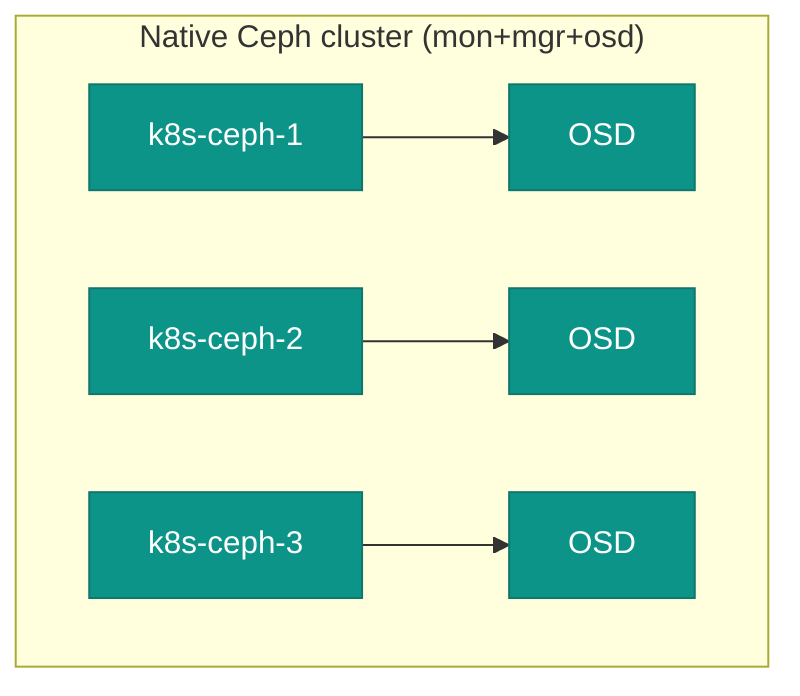

# 06. Ceph

**Goal:** After [05-deploy-kubernetes.md](05-deploy-kubernetes.md) — nodes `Ready`, Calico up — bootstrap Ceph as native `apt` packages and systemd services on `k8s-ceph-1/2/3` (no Rook operator pods — see [00-overview.md](00-overview.md)), then let Kubernetes consume it via the lean Ceph-CSI driver. Do not install Ceph before the cluster exists: the CSI pods have nowhere to run until then. Do not install Ceph on the Kubernetes workers.

Mon, mgr, and one OSD share a Ceph VM. Three VMs give a mon quorum and three OSDs, on the dedicated disks from [01-inventory.md](01-inventory.md). This is unrelated to the etcd tier (`k8s-etcd-*` in the external scenario) — Ceph's own mon/quorum is entirely separate from Kubernetes' etcd.

Distro apt only ever carries one Ceph release per OS release, which leaves nothing to upgrade *to* later. Debian 13 as of 2026-09 bundles Reef (`18.2.7+ds-1+deb13u1`), which upstream already retired in March 2026. So this uses Ceph's own apt repo instead (`$(lsb_release -sc)` picks `trixie` or the Ubuntu 26 codename), pinned one release behind current stable (same reasoning as the Kubernetes pin in [05-deploy-kubernetes.md](05-deploy-kubernetes.md)), so [12-update-ceph.md](12-update-ceph.md) has a real target: **Squid (v19.x) → Tentacle (v20.x)**.

> **OS caveat, checked 2026-09:** Ceph's [OS recommendations](https://docs.ceph.com/en/latest/start/os-recommendations/) rate Debian 13 tier "C" (packages exist, untested). Ubuntu 26 may or may not be listed yet — check that page before you add the repo. Try the repo below first; if `apt update` fails, Debian's fallback is its bundled Reef (`apt-cache policy ceph-common`) as a stopgap (already past upstream EOL). On Ubuntu, do not fall back to an unmaintained distro Ceph; fix the Ceph repo or stop.

## Steps — native Ceph cluster (run on `k8s-ceph-1/2/3`)

These three VMs are the Ceph cluster in every scenario. They are not kubelet nodes. Do not install Ceph on `k8s-work-*`, including the GPU node.

**1. Ceph packages on all three Ceph VMs** — Ceph's own repo, one release behind current stable, then hold them.
```sh
CEPH_DEPLOY_RELEASE=squid          # v19; recheck docs.ceph.com/en/latest/releases
curl -fsSL https://download.ceph.com/keys/release.asc | sudo gpg --dearmor -o /usr/share/keyrings/ceph.gpg
cat /etc/apt/sources.list.d/ceph.list 2>/dev/null || true
echo "deb [signed-by=/usr/share/keyrings/ceph.gpg] https://download.ceph.com/debian-${CEPH_DEPLOY_RELEASE}/ $(lsb_release -sc) main" \
  | sudo tee /etc/apt/sources.list.d/ceph.list     # suite comes from this VM's codename
cat /etc/apt/sources.list.d/ceph.list              # apt reads this file
sudo apt update
apt-cache madison ceph-common                      # copy the exact version string
CEPH_DEPLOY_VERSION="19.2.6-1~$(lsb_release -sc)"  # must match madison
sudo apt install -y ceph-mon=${CEPH_DEPLOY_VERSION} ceph-mgr=${CEPH_DEPLOY_VERSION} \
  ceph-osd=${CEPH_DEPLOY_VERSION} ceph-common=${CEPH_DEPLOY_VERSION}
sudo apt-mark hold ceph-mon ceph-mgr ceph-osd ceph-common
```
Use the same `CEPH_DEPLOY_VERSION` on all three nodes.

**2. Cluster identity** — once, on `k8s-ceph-1`. The mons read `/etc/ceph/ceph.conf`. Copy that finished file to the other two Ceph VMs and `grep fsid` there before their mons start.
```sh
cat /etc/ceph/ceph.conf 2>/dev/null || true          # package sample, read before replace
FSID=$(uuidgen)
echo "$FSID"   # Ceph-CSI clusterID; keep it
sudo tee /etc/ceph/ceph.conf <<EOF
[global]
fsid = ${FSID}
mon initial members = k8s-ceph-1, k8s-ceph-2, k8s-ceph-3
mon host = 10.0.1.25, 10.0.1.26, 10.0.1.27
public network = 10.0.1.0/24
auth cluster required = cephx
auth service required = cephx
auth client required = cephx
osd pool default size = 3
EOF
grep -n fsid /etc/ceph/ceph.conf
```
Copy this `ceph.conf` to `/etc/ceph/ceph.conf` on `k8s-ceph-2` and `k8s-ceph-3`. On each, `grep fsid /etc/ceph/ceph.conf` must show the same id before step 4.

**3. Generate keyrings and monmap** (once, on `k8s-ceph-1`, then copy the resulting files to the other two):
```sh
sudo ceph-authtool --create-keyring /tmp/ceph.mon.keyring --gen-key -n mon. --cap mon 'allow *'
sudo ceph-authtool --create-keyring /etc/ceph/ceph.client.admin.keyring --gen-key \
  -n client.admin --cap mon 'allow *' --cap osd 'allow *' --cap mds 'allow *' --cap mgr 'allow *'
sudo ceph-authtool /tmp/ceph.mon.keyring --import-keyring /etc/ceph/ceph.client.admin.keyring

sudo monmaptool --create --fsid "$FSID" \
  --add k8s-ceph-1 10.0.1.25 --add k8s-ceph-2 10.0.1.26 --add k8s-ceph-3 10.0.1.27 \
  /tmp/monmap
```
Copy `/tmp/ceph.mon.keyring`, `/tmp/monmap`, and `/etc/ceph/ceph.client.admin.keyring` to the same paths on `k8s-ceph-2`/`k8s-ceph-3`.

**4. Bootstrap each mon** — same commands on all three. Change the hostname to the local node.
```sh
sudo -u ceph mkdir -p /var/lib/ceph/mon/ceph-k8s-ceph-1          # owned by ceph, not root
sudo -u ceph ceph-mon --mkfs -i k8s-ceph-1 --monmap /tmp/monmap --keyring /tmp/ceph.mon.keyring
sudo systemctl enable ceph-mon@k8s-ceph-1
sudo systemctl restart ceph-mon@k8s-ceph-1                      # this unit reads ceph.conf
```

**5. Bootstrap each mgr** — create the directory first. `ceph auth -o` will not create parent directories.
```sh
ls -ld /var/lib/ceph/mgr/ceph-k8s-ceph-1 2>/dev/null || true
sudo mkdir -p /var/lib/ceph/mgr/ceph-k8s-ceph-1
sudo chown ceph:ceph /var/lib/ceph/mgr/ceph-k8s-ceph-1
sudo ceph auth get-or-create mgr.k8s-ceph-1 mon 'allow profile mgr' osd 'allow *' mds 'allow *' \
  -o /var/lib/ceph/mgr/ceph-k8s-ceph-1/keyring
ls -l /var/lib/ceph/mgr/ceph-k8s-ceph-1/keyring                  # root-owned until the next line
sudo chown ceph:ceph /var/lib/ceph/mgr/ceph-k8s-ceph-1/keyring   # daemon cannot read a root-owned key
ls -l /var/lib/ceph/mgr/ceph-k8s-ceph-1/keyring                  # ceph:ceph
sudo systemctl enable ceph-mgr@k8s-ceph-1
sudo systemctl restart ceph-mgr@k8s-ceph-1                      # the unit reads that keyring
```

**6. Bootstrap-OSD keyring** — `ceph-volume` authenticates as `client.bootstrap-osd`. Without this file, OSD create fails ([Ceph manual deployment](https://docs.ceph.com/en/latest/install/manual-deployment/)):
```sh
sudo mkdir -p /var/lib/ceph/bootstrap-osd
sudo ceph auth get-or-create client.bootstrap-osd \
  mon 'profile bootstrap-osd' mgr 'allow r' \
  -o /var/lib/ceph/bootstrap-osd/ceph.keyring
```
Copy `/var/lib/ceph/bootstrap-osd/ceph.keyring` (and `/etc/ceph/ceph.conf` if not already there) to `k8s-ceph-2` and `k8s-ceph-3`.

**7. One OSD per Ceph VM** — check the device with `lsblk` first. Do not guess `/dev/sdb`.
```sh
sudo apt install -y lvm2                         # ceph-volume uses LVM
sudo ceph-volume lvm create --data /dev/sdb      # wipe and claim this disk
sudo ceph -s                                     # 3 mons in quorum, 3 osds up
```

## Steps — expose storage to Kubernetes via Ceph-CSI

**9. Pool and CSI client** — the key printed here goes into the Kubernetes Secret.
```sh
sudo ceph osd pool create kubernetes
sudo rbd pool init kubernetes
sudo ceph auth get-or-create client.kubernetes \
  mon 'profile rbd' osd 'profile rbd pool=kubernetes' mgr 'profile rbd pool=kubernetes' \
  -o /etc/ceph/ceph.client.kubernetes.keyring          # this client can only use this pool
sudo ceph auth print-key client.kubernetes             # paste into the Secret in step 11
```

**10. Ceph-CSI chart** — from `k8s-bastion`. Helm is already there. Pin the chart version.
```sh
helm repo add ceph-csi https://ceph.github.io/csi-charts && helm repo update
helm search repo ceph-csi/ceph-csi-rbd --versions | head   # copy one chart version
CEPH_CSI_CHART_VERSION="<version from the list above>"
kubectl create namespace ceph-csi-rbd
helm install ceph-csi-rbd ceph-csi/ceph-csi-rbd -n ceph-csi-rbd --version "${CEPH_CSI_CHART_VERSION}" \
  --set csiConfig[0].clusterID="${FSID}" \
  --set csiConfig[0].monitors[0]=10.0.1.25:6789 \
  --set csiConfig[0].monitors[1]=10.0.1.26:6789 \
  --set csiConfig[0].monitors[2]=10.0.1.27:6789
```

**11. Secret + StorageClass:**
```sh
kubectl create secret generic csi-rbd-secret -n ceph-csi-rbd \
  --from-literal=userID=kubernetes --from-literal=userKey=<key from step 9>

cat <<EOF | kubectl apply -f -
apiVersion: storage.k8s.io/v1
kind: StorageClass
metadata:
  name: ceph-rbd
provisioner: rbd.csi.ceph.com
parameters:
  clusterID: "${FSID}"
  pool: kubernetes
  csi.storage.k8s.io/provisioner-secret-name: csi-rbd-secret
  csi.storage.k8s.io/provisioner-secret-namespace: ceph-csi-rbd
  csi.storage.k8s.io/node-stage-secret-name: csi-rbd-secret
  csi.storage.k8s.io/node-stage-secret-namespace: ceph-csi-rbd
reclaimPolicy: Delete
allowVolumeExpansion: true
EOF
```

**12. Verify** with a test PVC — confirm it reaches `Bound`, then delete it.

## Ceph cluster layout



## Prerequisites
- [05-deploy-kubernetes.md](05-deploy-kubernetes.md)

## Next
- [07-ingress.md](07-ingress.md)
