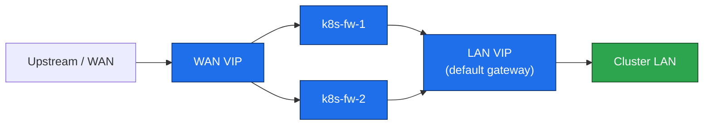

# 06. Firewall pair

**Goal:** Put a two-node keepalived firewall in front of the LAN so the cluster has a redundant default gateway and a single WAN entry. The apiserver VIP on the bastion ([09-load-balancer.md](09-load-balancer.md)) is a separate address; do not merge the two.

**Applies to:** `k8s-fw-1` and `k8s-fw-2` only. Not a Kubernetes node — no kubelet, no containerd.

WAN addresses, WAN VIP, and VRID are **site-local**. This file uses variables. Do not copy a production/lab WAN numbering plan into the repo.

```sh
WAN_IF=eth0                 # NIC that faces upstream
LAN_IF=eth1                 # NIC on the cluster LAN (10.0.1.0/24 in the example tables)
WAN_VIP="<your WAN VIP>"    # keepalived address on $WAN_IF
LAN_VIP=10.0.1.254          # example LAN gateway — must match [05-os-baseline.md](05-os-baseline.md)
VRID=60                     # unique per lab instance on a shared L2; pick another if 60 is taken
```

`k8s-fw-1` is MASTER (priority 100), `k8s-fw-2` is BACKUP (priority 90). Same `VRID` on both instances is fine because they run on different interfaces.

## Steps

**1. Enable forwarding** (both firewall nodes):
```sh
cat <<EOF | sudo tee /etc/sysctl.d/k8s-fw.conf
net.ipv4.ip_forward = 1
net.ipv4.conf.all.forwarding = 1
EOF
sudo sysctl --system
```

**2. Install a pinned keepalived** (same version on both nodes):
```sh
sudo apt update
apt-cache madison keepalived
KEEPALIVED_VERSION="<version from the list above>"
sudo apt install -y keepalived=${KEEPALIVED_VERSION}
sudo apt-mark hold keepalived
```

**3. Configure keepalived** — `/etc/keepalived/keepalived.conf` on `k8s-fw-1` (MASTER). Substitute interface names and `$WAN_VIP`. Do not put a real passphrase in git; set `auth_pass` locally (8 chars, keepalived truncates anyway):

```
vrrp_instance WAN {
    state MASTER
    interface ${WAN_IF}
    virtual_router_id ${VRID}
    priority 100
    advert_int 1
    authentication {
        auth_type PASS
        auth_pass <local-only>
    }
    virtual_ipaddress {
        ${WAN_VIP}
    }
}

vrrp_instance LAN {
    state MASTER
    interface ${LAN_IF}
    virtual_router_id ${VRID}
    priority 100
    advert_int 1
    authentication {
        auth_type PASS
        auth_pass <local-only>
    }
    virtual_ipaddress {
        10.0.1.254/24
    }
}
```

On `k8s-fw-2`: same file with `state BACKUP` and `priority 90` in both instances. Then:

```sh
sudo systemctl enable --now keepalived
ip -br addr show   # MASTER should show both VIPs; BACKUP should not
```

**4. Forward LAN → WAN** (both nodes; nftables). This is a lab NAT, not a hardened edge policy:

```sh
sudo nft add table ip nat
sudo nft add chain ip nat postrouting '{ type nat hook postrouting priority 100; }'
sudo nft add rule ip nat postrouting oifname "$WAN_IF" masquerade
sudo nft add table ip filter
sudo nft add chain ip filter forward '{ type filter hook forward priority 0; policy drop; }'
sudo nft add rule ip filter forward ct state established,related accept
sudo nft add rule ip filter forward iifname "$LAN_IF" oifname "$WAN_IF" accept
sudo nft add rule ip filter forward iifname "$WAN_IF" oifname "$LAN_IF" ct state established,related accept
```

Persist with `nft list ruleset | sudo tee /etc/nftables.conf` and `sudo systemctl enable nftables` (package name is `nftables` on both Debian 13 and Ubuntu 26).

**5. Point the cluster at the LAN VIP** — default gateway `10.0.1.254` on every non-firewall VM (already called out in [05-os-baseline.md](05-os-baseline.md)). From a worker:

```sh
ip route | grep default    # via 10.0.1.254
ping -c1 10.0.1.254
curl -sI https://deb.debian.org | head -1   # or https://archive.ubuntu.com — outbound via the pair
```

Failover check: `sudo systemctl stop keepalived` on MASTER; VIPs must appear on BACKUP within a couple of seconds; restore keepalived on MASTER afterward.

## Request path



## Prerequisites
- [05-os-baseline.md](05-os-baseline.md)

## Next
- [07-nexus.md](07-nexus.md)
