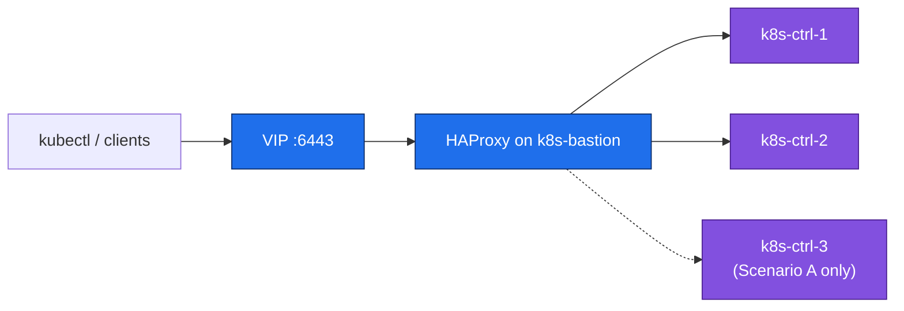

# 07. Bastion / Load Balancer

**Goal:** Stand up the apiserver-facing load balancer (and jump host) on `k8s-bastion` before bootstrapping the control plane.

## Covers
- HAProxy (or similar) frontend for the kube-apiserver VIP defined in [03-network-plan.md](03-network-plan.md)
- Health checks against control-plane nodes
- Optional: keepalived for VIP failover if the bastion itself becomes a target for HA
- Bastion's role as an SSH jump host into the private VM network

## Applies to
Both scenarios — the bastion always load-balances across the control-plane nodes (3 in Scenario A, 2 in Scenario B).

## Request path

## Prerequisites
- [06-container-runtime.md](06-container-runtime.md) (bastion itself doesn't need a container runtime, but control-plane targets must be reachable)

## Next
- Scenario A: [08-stacked-etcd-bootstrap.md](08-stacked-etcd-bootstrap.md)
- Scenario B: [08-external-etcd-bootstrap.md](08-external-etcd-bootstrap.md)
