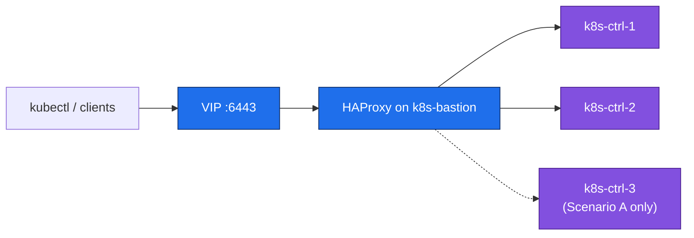

# 07. Bastion / Load Balancer

**Goal:** Stand up the apiserver-facing load balancer (and jump host) on `k8s-bastion` before bootstrapping the control plane.

## Steps

**1. Install and hold HAProxy** (single bastion VM, so no keepalived/VRRP needed — the bastion itself is the single point of entry by design in this lab):
```sh
sudo apt update && sudo apt install -y haproxy
sudo apt-mark hold haproxy
```

**2. Configure the apiserver frontend/backend** — `/etc/haproxy/haproxy.cfg`, append:
```
frontend k8s-apiserver
    bind 10.0.1.10:6443
    mode tcp
    option tcplog
    default_backend k8s-apiserver-backend

backend k8s-apiserver-backend
    mode tcp
    option tcp-check
    balance roundrobin
    server k8s-ctrl-1 10.0.1.12:6443 check fall 3 rise 2
    server k8s-ctrl-2 10.0.1.13:6443 check fall 3 rise 2
    # Scenario A only:
    server k8s-ctrl-3 10.0.1.14:6443 check fall 3 rise 2
```
Drop the `k8s-ctrl-3` line on Scenario B (2 control-plane nodes only). `10.0.1.10` is the VIP clients and `kubeadm` will target — see [03-network-plan.md](03-network-plan.md).

**3. Apply and verify:**
```sh
sudo haproxy -c -f /etc/haproxy/haproxy.cfg
sudo systemctl restart haproxy
sudo systemctl enable haproxy
```
The backend checks will show all control-plane servers as `DOWN` until step 08 actually starts the apiserver on them — that's expected at this point.

## Applies to
Both scenarios — the bastion always load-balances across the control-plane nodes (3 in Scenario A, 2 in Scenario B).

## Request path



## Prerequisites
- [06-container-runtime.md](06-container-runtime.md) (bastion itself doesn't need a container runtime, but control-plane targets must be reachable)

## Next
- Scenario A: [08-stacked-etcd-bootstrap.md](08-stacked-etcd-bootstrap.md)
- Scenario B: [08-external-etcd-bootstrap.md](08-external-etcd-bootstrap.md)
