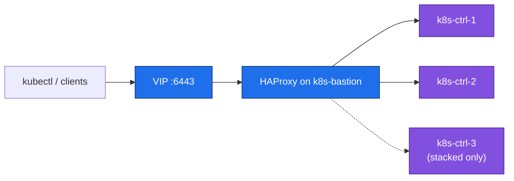

# 07. Bastion / Load Balancer

**Goal:** Stand up the apiserver-facing load balancer (and jump host) on `k8s-bastion` before bootstrapping the control plane.

## Steps

**1. Install a pinned, held HAProxy version** (single bastion VM, so no keepalived/VRRP needed — the bastion itself is the single point of entry by design in this lab):
```sh
sudo apt update
apt-cache madison haproxy   # list exact available versions — pick one
HAPROXY_VERSION="<version from the list above>"
sudo apt install -y haproxy=${HAPROXY_VERSION}
sudo apt-mark hold haproxy
```

**2. Put `10.0.1.10` on the bastion NIC** — HAProxy `bind 10.0.1.10:6443` fails with `EADDRNOTAVAIL` unless that address exists on an interface. The bastion's primary IP is `10.0.1.11`; the VIP is a second address on the same L2 (no keepalived — single bastion is the SPOF by design).

```sh
IFACE=$(ip -br route show default | awk '{print $5; exit}')
echo "primary iface: $IFACE"   # confirm this is the 10.0.1.0/24 NIC before adding
sudo ip addr add 10.0.1.10/24 dev "$IFACE"
ip -br addr show "$IFACE"      # expect both 10.0.1.11 and 10.0.1.10
```

Persist across reboot. Debian 13 netinst is usually ifupdown — append a post-up to the stanza that already has `10.0.1.11`:

```sh
# ifupdown (typical netinst). Skip if that file is not how this VM gets 10.0.1.11.
echo "    up ip addr add 10.0.1.10/24 dev $IFACE" | sudo tee -a /etc/network/interfaces
```

If the VM uses NetworkManager instead: `nmcli con modify <connection> +ipv4.addresses 10.0.1.10/24 && nmcli con up <connection>`.

**3. Configure the apiserver frontend/backend** — `/etc/haproxy/haproxy.cfg`, append the snippet that matches your scenario. `10.0.1.10` is the VIP clients and `kubeadm` will target — see [03-network-plan.md](03-network-plan.md).

Stacked etcd — 3 control-plane backends:
```
frontend k8s-apiserver
    bind 10.0.1.10:6443
    mode tcp
    option tcplog
    default_backend k8s-apiserver-backend

backend k8s-apiserver-backend
    mode tcp
    option tcp-check
    balance roundrobin
    server k8s-ctrl-1 10.0.1.12:6443 check fall 3 rise 2
    server k8s-ctrl-2 10.0.1.13:6443 check fall 3 rise 2
    server k8s-ctrl-3 10.0.1.14:6443 check fall 3 rise 2
```

External etcd — 2 control-plane backends (no `k8s-ctrl-3`; etcd is a separate tier, not behind this LB):
```
frontend k8s-apiserver
    bind 10.0.1.10:6443
    mode tcp
    option tcplog
    default_backend k8s-apiserver-backend

backend k8s-apiserver-backend
    mode tcp
    option tcp-check
    balance roundrobin
    server k8s-ctrl-1 10.0.1.12:6443 check fall 3 rise 2
    server k8s-ctrl-2 10.0.1.13:6443 check fall 3 rise 2
```

**4. Apply and verify:**
```sh
sudo haproxy -c -f /etc/haproxy/haproxy.cfg
sudo systemctl restart haproxy
sudo systemctl enable haproxy
nc -zv 10.0.1.10 6443
```
`haproxy -c` only parses the file — it does not bind. `nc` should get **connection refused** (backends are empty until step 08). A timeout or "no route" means the VIP is still missing. Backend checks showing the control-plane servers as `DOWN` is expected until the apiserver is up.

## Request path


```mermaid
flowchart LR
    Client["kubectl / clients"] --> VIP["VIP :6443"]:::bastion
    VIP --> HAP["HAProxy on k8s-bastion"]:::bastion
    HAP --> C1["k8s-ctrl-1"]:::controlPlane
    HAP --> C2["k8s-ctrl-2"]:::controlPlane
    HAP -.-> C3["k8s-ctrl-3\n(stacked only)"]:::controlPlane

    classDef bastion fill:#1f6feb,stroke:#0c2d6b,color:#ffffff
    classDef controlPlane fill:#8250df,stroke:#4b1f91,color:#ffffff
    classDef etcd fill:#d29922,stroke:#7d5c05,color:#1a1a1a
    classDef worker fill:#2da44e,stroke:#164c24,color:#ffffff
    classDef storage fill:#0d9488,stroke:#0f766e,color:#ffffff
```

## Prerequisites
- [06-container-runtime.md](06-container-runtime.md) (bastion itself doesn't need a container runtime, but control-plane targets must be reachable)

## Next
- Stacked etcd: [08-bootstrap-stacked.md](08-bootstrap-stacked.md)
- External etcd: [08-bootstrap-external.md](08-bootstrap-external.md)
