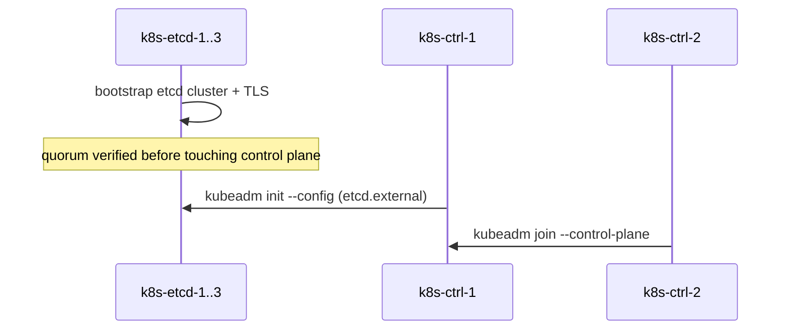
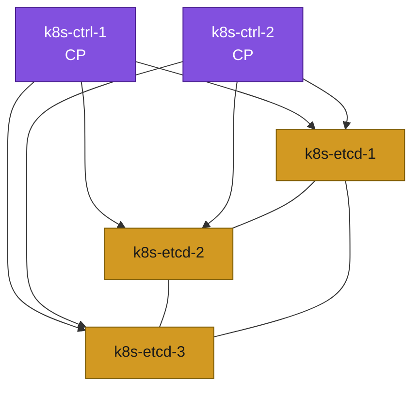

# 08. Bootstrap — External etcd

**Goal:** Stand up an independent etcd cluster, then initialize the control plane against it.

Open this file only if you circled **Scenario B (external etcd)** in [02-hardware-inventory.md](02-hardware-inventory.md). Stacked etcd: [08-bootstrap-stacked.md](08-bootstrap-stacked.md).

## Steps

Etcd here runs as a native systemd service on `k8s-etcd-1/2/3` (no kubelet/containerd on these nodes — keeps them outside the "less containers" tradeoff entirely, per [00-overview.md](00-overview.md)).

**1. Install a pinned etcd version on `k8s-etcd-1/2/3`** (verify the exact package name first — Debian splits it as `etcd-server`/`etcd-client` on recent releases), same version on all three:
```sh
sudo apt update
apt-cache madison etcd-server   # list exact available versions — pick one
ETCD_VERSION="<version from the list above>"
sudo apt install -y etcd-server=${ETCD_VERSION} etcd-client=${ETCD_VERSION}
sudo apt-mark hold etcd-server etcd-client
sudo systemctl stop etcd   # reconfigure before first real start
```

**2. Generate a CA, per-node server certs, and an apiserver client cert** — run once on `k8s-etcd-1`, then distribute. Debian 13 is OpenSSL 3: `openssl x509 -req` does **not** copy SAN from the CSR unless you pass `-copy_extensions copy`. Without SAN, etcd TLS fails hostname/IP checks.

```sh
mkdir -p /tmp/etcd-pki && cd /tmp/etcd-pki
openssl genrsa -out ca-key.pem 4096
openssl req -x509 -new -nodes -key ca-key.pem -days 3650 -out ca.pem -subj "/CN=etcd-ca"

# per-node server/peer cert — own DNS + IP + localhost (listen-client-urls includes 127.0.0.1)
declare -A ETCD_IPS=([k8s-etcd-1]=10.0.1.15 [k8s-etcd-2]=10.0.1.16 [k8s-etcd-3]=10.0.1.17)
for node in k8s-etcd-1 k8s-etcd-2 k8s-etcd-3; do
  ip=${ETCD_IPS[$node]}
  openssl genrsa -out ${node}-key.pem 2048
  openssl req -new -key ${node}-key.pem -out ${node}.csr -subj "/CN=${node}" \
    -addext "subjectAltName=DNS:${node},DNS:localhost,IP:${ip},IP:127.0.0.1"
  openssl x509 -req -in ${node}.csr -CA ca.pem -CAkey ca-key.pem -CAcreateserial \
    -out ${node}.pem -days 825 -copy_extensions copy
  openssl x509 -in ${node}.pem -noout -text | grep -A1 "Subject Alternative Name"
done

# dedicated client cert for kube-apiserver (official HA path: apiserver-etcd-client)
openssl genrsa -out apiserver-etcd-client.key 2048
openssl req -new -key apiserver-etcd-client.key -out apiserver-etcd-client.csr \
  -subj "/CN=kube-apiserver-etcd-client"
openssl x509 -req -in apiserver-etcd-client.csr -CA ca.pem -CAkey ca-key.pem -CAcreateserial \
  -out apiserver-etcd-client.crt -days 825
```

`scp` `/tmp/etcd-pki/` from `k8s-etcd-1` to the other etcd nodes and both control-plane nodes first. Then, on each etcd node, install that node's server cert (keys `chmod 600`, owned by `etcd`):
```sh
sudo mkdir -p /etc/etcd/pki
sudo cp /tmp/etcd-pki/ca.pem /etc/etcd/pki/ca.pem
sudo cp /tmp/etcd-pki/k8s-etcd-N.pem /etc/etcd/pki/k8s-etcd-N.pem
sudo cp /tmp/etcd-pki/k8s-etcd-N-key.pem /etc/etcd/pki/k8s-etcd-N-key.pem
sudo chown -R etcd:etcd /etc/etcd/pki
sudo chmod 600 /etc/etcd/pki/*-key.pem
```

On **both** `k8s-ctrl-1` and `k8s-ctrl-2`, install the CA + apiserver client cert at the paths kubeadm expects ([HA with kubeadm](https://kubernetes.io/docs/setup/production-environment/tools/kubeadm/high-availability/)):
```sh
sudo mkdir -p /etc/kubernetes/pki/etcd
sudo cp /tmp/etcd-pki/ca.pem /etc/kubernetes/pki/etcd/ca.crt
sudo cp /tmp/etcd-pki/apiserver-etcd-client.crt /etc/kubernetes/pki/apiserver-etcd-client.crt
sudo cp /tmp/etcd-pki/apiserver-etcd-client.key /etc/kubernetes/pki/apiserver-etcd-client.key
sudo chmod 600 /etc/kubernetes/pki/apiserver-etcd-client.key
```
Keep `ca-key.pem` only on `k8s-etcd-1` (or offline). You need it to mint replacement certs later, not on the control-plane nodes.

**3. Configure each node** — `/etc/default/etcd` (or `/etc/etcd/etcd.conf.yml`, depending on the packaged unit), same pattern on all three, only the local name/IP changes:
```
ETCD_NAME=k8s-etcd-1
ETCD_INITIAL_CLUSTER="k8s-etcd-1=https://10.0.1.15:2380,k8s-etcd-2=https://10.0.1.16:2380,k8s-etcd-3=https://10.0.1.17:2380"
ETCD_INITIAL_CLUSTER_STATE=new
ETCD_INITIAL_CLUSTER_TOKEN=k8s-lab-etcd
ETCD_LISTEN_PEER_URLS=https://10.0.1.15:2380
ETCD_LISTEN_CLIENT_URLS=https://10.0.1.15:2379,https://127.0.0.1:2379
ETCD_INITIAL_ADVERTISE_PEER_URLS=https://10.0.1.15:2380
ETCD_ADVERTISE_CLIENT_URLS=https://10.0.1.15:2379
ETCD_TRUSTED_CA_FILE=/etc/etcd/pki/ca.pem
ETCD_CERT_FILE=/etc/etcd/pki/k8s-etcd-1.pem
ETCD_KEY_FILE=/etc/etcd/pki/k8s-etcd-1-key.pem
ETCD_PEER_TRUSTED_CA_FILE=/etc/etcd/pki/ca.pem
ETCD_PEER_CERT_FILE=/etc/etcd/pki/k8s-etcd-1.pem
ETCD_PEER_KEY_FILE=/etc/etcd/pki/k8s-etcd-1-key.pem
ETCD_CLIENT_CERT_AUTH=true
ETCD_PEER_CLIENT_CERT_AUTH=true
```
Then on all three: `sudo systemctl enable --now etcd`.

**4. Verify quorum** (from any etcd node):
```sh
etcdctl --endpoints=https://10.0.1.15:2379,https://10.0.1.16:2379,https://10.0.1.17:2379 \
  --cacert=/etc/etcd/pki/ca.pem --cert=/etc/etcd/pki/k8s-etcd-1.pem --key=/etc/etcd/pki/k8s-etcd-1-key.pem \
  endpoint health --cluster
```
All 3 must report healthy before continuing.

**5. Install kubelet/kubeadm/kubectl on `k8s-ctrl-1/2` only** — deliberately one minor behind current stable so [16-day2-operations.md](16-day2-operations.md) has a real upgrade to practice:
```sh
KUBE_DEPLOY_MINOR=v1.36   # checked 2026-09: current stable is v1.37, so one behind = v1.36 — reverify at kubernetes.io/releases, it moves every ~4 months
sudo mkdir -p /etc/apt/keyrings
curl -fsSL "https://pkgs.k8s.io/core:/stable:/${KUBE_DEPLOY_MINOR}/deb/Release.key" \
  | sudo gpg --dearmor -o /etc/apt/keyrings/kubernetes-apt-keyring.gpg
echo "deb [signed-by=/etc/apt/keyrings/kubernetes-apt-keyring.gpg] https://pkgs.k8s.io/core:/stable:/${KUBE_DEPLOY_MINOR}/deb/ /" \
  | sudo tee /etc/apt/sources.list.d/kubernetes.list
sudo apt update

apt-cache madison kubeadm   # list exact available patch versions in this minor — pick one; 1.36.4 was latest as of 2026-09
KUBE_DEPLOY_VERSION="1.36.4-1.1"   # confirm this exact string (Debian package revision suffix) against the madison output above

sudo apt install -y kubelet=${KUBE_DEPLOY_VERSION} kubeadm=${KUBE_DEPLOY_VERSION} kubectl=${KUBE_DEPLOY_VERSION}
sudo apt-mark hold kubelet kubeadm kubectl
sudo systemctl enable kubelet
```
Use the **same** `KUBE_DEPLOY_VERSION` on both control-plane nodes. The etcd CA + `apiserver-etcd-client` files from step 2 must already be on both nodes.

**6. `kubeadm init` on `k8s-ctrl-1`** — kubeadm has **no** `--external-etcd-*` CLI flags. External etcd is a `ClusterConfiguration` in a config file ([HA with kubeadm](https://kubernetes.io/docs/setup/production-environment/tools/kubeadm/high-availability/)). Do not mix `--config` with `--pod-network-cidr` / `--control-plane-endpoint`; those fields live in the YAML.

```sh
cat <<EOF | sudo tee /root/kubeadm-config.yaml
apiVersion: kubeadm.k8s.io/v1beta4
kind: ClusterConfiguration
kubernetesVersion: v${KUBE_DEPLOY_VERSION%%-*}
controlPlaneEndpoint: "10.0.1.10:6443"
networking:
  podSubnet: "192.168.0.0/16"
etcd:
  external:
    endpoints:
      - https://10.0.1.15:2379
      - https://10.0.1.16:2379
      - https://10.0.1.17:2379
    caFile: /etc/kubernetes/pki/etcd/ca.crt
    certFile: /etc/kubernetes/pki/apiserver-etcd-client.crt
    keyFile: /etc/kubernetes/pki/apiserver-etcd-client.key
EOF

sudo kubeadm init --config /root/kubeadm-config.yaml --upload-certs
```
Save the two `kubeadm join` commands it prints. Then, still on `k8s-ctrl-1`:
```sh
mkdir -p $HOME/.kube
sudo cp -i /etc/kubernetes/admin.conf $HOME/.kube/config
sudo chown $(id -u):$(id -g) $HOME/.kube/config
```

**7. On `k8s-ctrl-2`** — confirm `/etc/kubernetes/pki/etcd/ca.crt` and `/etc/kubernetes/pki/apiserver-etcd-client.{crt,key}` are already present (step 2), then run the `--control-plane` join command printed by step 6 (`--certificate-key` expires after 2 hours; regenerate on `k8s-ctrl-1` with `sudo kubeadm init phase upload-certs --upload-certs` if needed).

**8. Set up `kubectl` access from `k8s-bastion` and your workstation** — `10.0.1.0/24` generally isn't reachable directly from outside, so the bastion is the intended jump point; don't rely on `k8s-ctrl-1` alone for day-to-day access.

On `k8s-bastion` — same Kubernetes apt repo as the control-plane nodes (step 5; the bastion never ran that step, so add the repo here), `kubectl` only, no `kubelet`/`kubeadm`:
```sh
KUBE_DEPLOY_MINOR=v1.36            # MUST match step 5
KUBE_DEPLOY_VERSION="1.36.4-1.1"   # MUST match step 5
sudo mkdir -p /etc/apt/keyrings
curl -fsSL "https://pkgs.k8s.io/core:/stable:/${KUBE_DEPLOY_MINOR}/deb/Release.key" \
  | sudo gpg --dearmor -o /etc/apt/keyrings/kubernetes-apt-keyring.gpg
echo "deb [signed-by=/etc/apt/keyrings/kubernetes-apt-keyring.gpg] https://pkgs.k8s.io/core:/stable:/${KUBE_DEPLOY_MINOR}/deb/ /" \
  | sudo tee /etc/apt/sources.list.d/kubernetes.list
sudo apt update
sudo apt install -y kubectl=${KUBE_DEPLOY_VERSION}
sudo apt-mark hold kubectl
mkdir -p ~/.kube
scp k8s-ctrl-1:.kube/config ~/.kube/config
chmod 600 ~/.kube/config
kubectl get nodes   # confirm it works from the bastion
```

On your workstation (outside the lab's VMs entirely):
1. Copy the same kubeconfig down through the bastion, e.g. `scp k8s-bastion:.kube/config ~/.kube/config`.
2. Install `kubectl` locally, matching `KUBE_DEPLOY_MINOR` (client skew of ±1 minor from the server is fine, but staying aligned means you never have to think about it):
   - Linux: `curl -fsSL -o kubectl "https://dl.k8s.io/release/v${KUBE_DEPLOY_VERSION%%-*}/bin/linux/amd64/kubectl" && chmod +x kubectl && sudo mv kubectl /usr/local/bin/`
   - macOS: `brew install kubectl`, or the same `curl` pattern with `darwin/amd64`/`darwin/arm64`
   - Windows: see [kubernetes.io/docs/tasks/tools/install-kubectl-windows](https://kubernetes.io/docs/tasks/tools/install-kubectl-windows/)
3. The apiserver VIP (`10.0.1.10:6443`) is only reachable from inside `10.0.1.0/24` — tunnel through the bastion rather than pointing the kubeconfig at an address your workstation can't route to:
   ```sh
   ssh -N -L 6443:10.0.1.10:6443 <user>@<bastion-reachable-address> &
   ```
   Then edit the kubeconfig's `server:` line to `https://127.0.0.1:6443`. kubeadm's default apiserver certificate includes `localhost`/`127.0.0.1` as SANs, so this works without regenerating certs — verify if you want to be sure: `openssl x509 -in /etc/kubernetes/pki/apiserver.crt -noout -text | grep -A1 "Subject Alternative Name"` on `k8s-ctrl-1`.
4. Verify: `kubectl get nodes` from your workstation, through the tunnel.

## Bootstrap sequence





## Applies to
External etcd (any profile). Hardware: Scenario B table for your profile in [02-hardware-inventory.md](02-hardware-inventory.md).

## Prerequisites
- [07-load-balancer.md](07-load-balancer.md)
- [02-hardware-inventory.md](02-hardware-inventory.md)

## Next
- [09-join-nodes.md](09-join-nodes.md)
