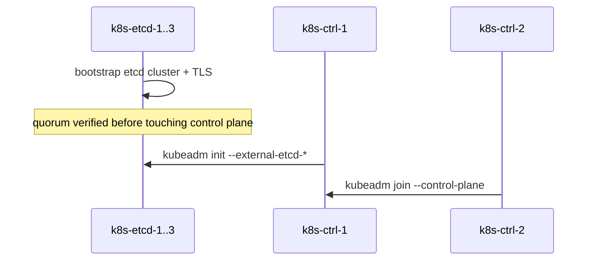
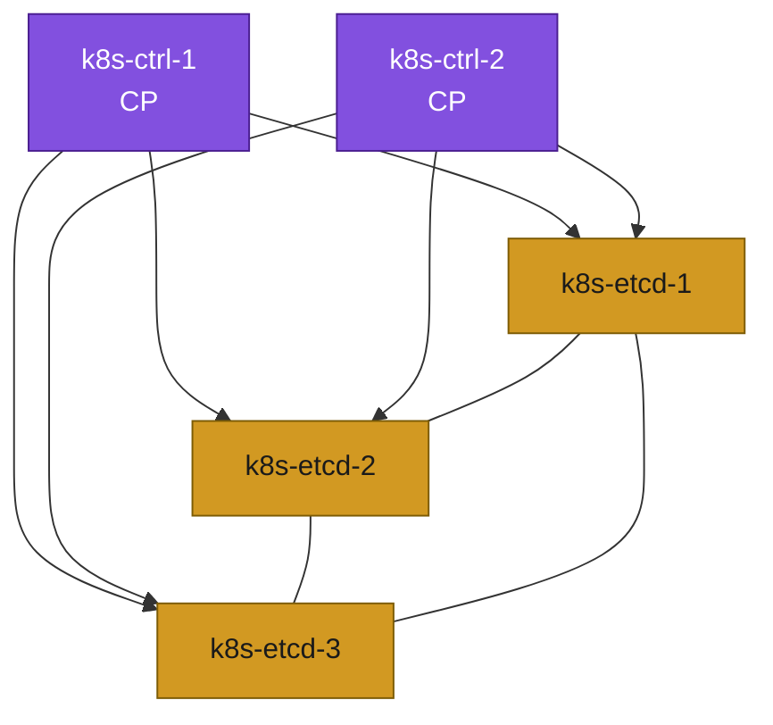

# 08. Bootstrap — External etcd (Scenario B)

**Goal:** Stand up an independent etcd cluster, then initialize the control plane against it.

## Covers
- TLS certificate generation for the etcd cluster (etcd CA, peer, server, client certs)
- etcd cluster bootstrap across `k8s-etcd-1/2/3`
- Verifying etcd quorum before touching the control plane
- `kubeadm init` on `k8s-ctrl-1` with `--external-etcd-*` flags pointing at the etcd cluster
- `kubeadm join --control-plane` on `k8s-ctrl-2`

## Bootstrap sequence

## Applies to
Scenario B only.

## Prerequisites
- [07-load-balancer.md](07-load-balancer.md)
- [02-hardware-inventory.md](02-hardware-inventory.md) — Scenario B table

## Next
- [09-join-nodes.md](09-join-nodes.md)
