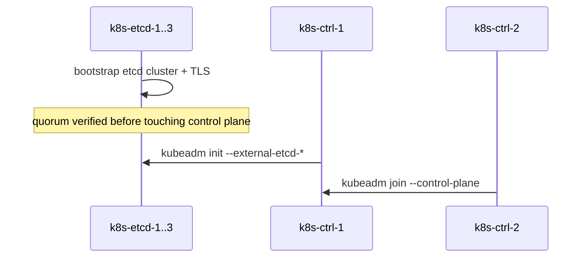
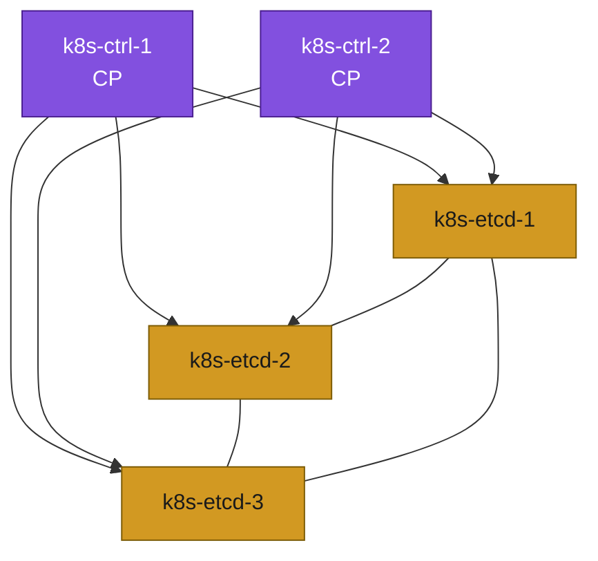

# 08. Bootstrap — External etcd (Scenario B)

**Goal:** Stand up an independent etcd cluster, then initialize the control plane against it.

## Steps

Etcd here runs as a native systemd service on `k8s-etcd-1/2/3` (no kubelet/containerd on these nodes — keeps them outside the "less containers" tradeoff entirely, per [00-overview.md](00-overview.md)).

**1. Install etcd on `k8s-etcd-1/2/3`** (verify the exact package name first — Debian splits it as `etcd-server`/`etcd-client` on recent releases):
```sh
sudo apt update
sudo apt install -y etcd-server etcd-client
sudo apt-mark hold etcd-server etcd-client
sudo systemctl stop etcd   # reconfigure before first real start
```

**2. Generate a CA and per-node TLS certs** — run once, e.g. on `k8s-etcd-1`, then distribute:
```sh
mkdir -p /tmp/etcd-pki && cd /tmp/etcd-pki
openssl genrsa -out ca-key.pem 4096
openssl req -x509 -new -nodes -key ca-key.pem -days 3650 -out ca.pem -subj "/CN=etcd-ca"

for node in k8s-etcd-1 k8s-etcd-2 k8s-etcd-3; do
  openssl genrsa -out ${node}-key.pem 2048
  openssl req -new -key ${node}-key.pem -out ${node}.csr -subj "/CN=${node}" \
    -addext "subjectAltName=DNS:${node},IP:10.0.1.15,IP:10.0.1.16,IP:10.0.1.17"
  openssl x509 -req -in ${node}.csr -CA ca.pem -CAkey ca-key.pem -CAcreateserial \
    -out ${node}.pem -days 825
done
```
Copy `ca.pem`, `<node>.pem`, `<node>-key.pem` to `/etc/etcd/pki/` on the matching node (`chmod 600` the keys, owned by the `etcd` user).

**3. Configure each node** — `/etc/default/etcd` (or `/etc/etcd/etcd.conf.yml`, depending on the packaged unit), same pattern on all three, only the local name/IP changes:
```
ETCD_NAME=k8s-etcd-1
ETCD_INITIAL_CLUSTER="k8s-etcd-1=https://10.0.1.15:2380,k8s-etcd-2=https://10.0.1.16:2380,k8s-etcd-3=https://10.0.1.17:2380"
ETCD_INITIAL_CLUSTER_STATE=new
ETCD_INITIAL_CLUSTER_TOKEN=k8s-lab-etcd
ETCD_LISTEN_PEER_URLS=https://10.0.1.15:2380
ETCD_LISTEN_CLIENT_URLS=https://10.0.1.15:2379,https://127.0.0.1:2379
ETCD_INITIAL_ADVERTISE_PEER_URLS=https://10.0.1.15:2380
ETCD_ADVERTISE_CLIENT_URLS=https://10.0.1.15:2379
ETCD_TRUSTED_CA_FILE=/etc/etcd/pki/ca.pem
ETCD_CERT_FILE=/etc/etcd/pki/k8s-etcd-1.pem
ETCD_KEY_FILE=/etc/etcd/pki/k8s-etcd-1-key.pem
ETCD_PEER_TRUSTED_CA_FILE=/etc/etcd/pki/ca.pem
ETCD_PEER_CERT_FILE=/etc/etcd/pki/k8s-etcd-1.pem
ETCD_PEER_KEY_FILE=/etc/etcd/pki/k8s-etcd-1-key.pem
ETCD_CLIENT_CERT_AUTH=true
ETCD_PEER_CLIENT_CERT_AUTH=true
```
Then on all three: `sudo systemctl enable --now etcd`.

**4. Verify quorum** (from any etcd node):
```sh
etcdctl --endpoints=https://10.0.1.15:2379,https://10.0.1.16:2379,https://10.0.1.17:2379 \
  --cacert=/etc/etcd/pki/ca.pem --cert=/etc/etcd/pki/k8s-etcd-1.pem --key=/etc/etcd/pki/k8s-etcd-1-key.pem \
  endpoint health --cluster
```
All 3 must report healthy before continuing.

**5. Install kubelet/kubeadm/kubectl on `k8s-ctrl-1/2` only** (same repo setup as Scenario A — see [08-stacked-etcd-bootstrap.md](08-stacked-etcd-bootstrap.md) step 1), then copy the etcd CA + a client cert/key from step 2 onto `k8s-ctrl-1` (e.g. `/etc/kubernetes/pki/etcd/{ca,client,client-key}.pem`).

**6. `kubeadm init` on `k8s-ctrl-1`** pointing at the external etcd cluster:
```sh
sudo kubeadm init \
  --control-plane-endpoint "10.0.1.10:6443" \
  --upload-certs \
  --pod-network-cidr "192.168.0.0/16" \
  --external-etcd-endpoints "https://10.0.1.15:2379,https://10.0.1.16:2379,https://10.0.1.17:2379" \
  --external-etcd-cafile /etc/kubernetes/pki/etcd/ca.pem \
  --external-etcd-certfile /etc/kubernetes/pki/etcd/client.pem \
  --external-etcd-keyfile /etc/kubernetes/pki/etcd/client-key.pem
```

**7. On `k8s-ctrl-2`** — run the `--control-plane` join command printed by step 6 (same caveat as Scenario A: `--certificate-key` expires after 2 hours).

## Bootstrap sequence





## Applies to
Scenario B only.

## Prerequisites
- [07-load-balancer.md](07-load-balancer.md)
- [02-hardware-inventory.md](02-hardware-inventory.md) — Scenario B table

## Next
- [09-join-nodes.md](09-join-nodes.md)
