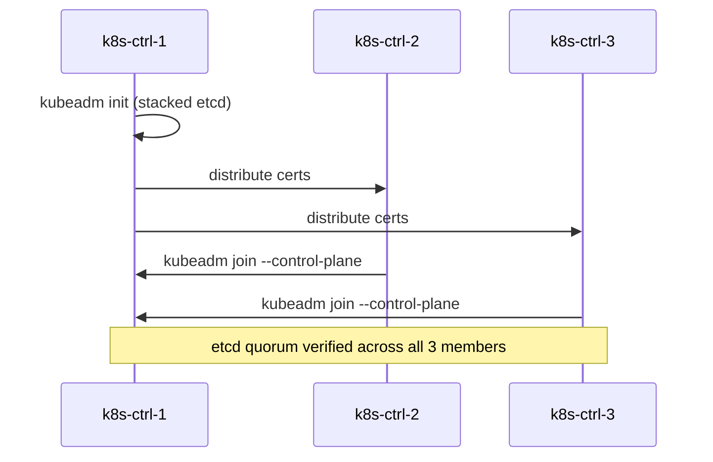
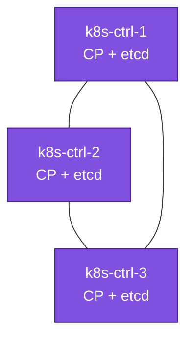

# 08. Bootstrap — Stacked etcd (Scenario A)

**Goal:** Initialize the HA control plane with `kubeadm`, etcd stacked on each control-plane node.

## Steps

**1. On every control-plane node** (`k8s-ctrl-1/2/3`) — add the Kubernetes apt repo for the minor you're **deploying** (deliberately one minor behind current stable — see [00-overview.md](00-overview.md#version-pinning-and-the-upgrade-exercise) — so [15-day2-operations.md](15-day2-operations.md) has a real upgrade to walk through), then install an **exact pinned patch version**, not just whatever `apt install` picks up latest in that minor:
```sh
KUBE_DEPLOY_MINOR=v1.33   # deploy minor: one behind current stable — check kubernetes.io/releases
sudo mkdir -p /etc/apt/keyrings
curl -fsSL "https://pkgs.k8s.io/core:/stable:/${KUBE_DEPLOY_MINOR}/deb/Release.key" \
  | sudo gpg --dearmor -o /etc/apt/keyrings/kubernetes-apt-keyring.gpg
echo "deb [signed-by=/etc/apt/keyrings/kubernetes-apt-keyring.gpg] https://pkgs.k8s.io/core:/stable:/${KUBE_DEPLOY_MINOR}/deb/ /" \
  | sudo tee /etc/apt/sources.list.d/kubernetes.list
sudo apt update

apt-cache madison kubeadm   # list exact available patch versions in this minor — pick one
KUBE_DEPLOY_VERSION="1.33.x-1.1"   # replace x with the patch you picked from the list above

sudo apt install -y kubelet=${KUBE_DEPLOY_VERSION} kubeadm=${KUBE_DEPLOY_VERSION} kubectl=${KUBE_DEPLOY_VERSION}
sudo apt-mark hold kubelet kubeadm kubectl
```
Use the **same** `KUBE_DEPLOY_VERSION` on all three control-plane nodes — a version mismatch between them is exactly the kind of thing this pinning is meant to prevent.

**2. On `k8s-ctrl-1` only** — initialize the cluster against the HAProxy VIP, with `--upload-certs` so the other control-plane nodes can join without manual cert copying. Pass `--kubernetes-version` explicitly so kubeadm doesn't reach out for whatever it thinks is latest — it must match the packages just installed:
```sh
sudo kubeadm init \
  --control-plane-endpoint "10.0.1.10:6443" \
  --upload-certs \
  --pod-network-cidr "192.168.0.0/16" \
  --kubernetes-version "v${KUBE_DEPLOY_VERSION%%-*}"
```
Save the two `kubeadm join` commands it prints (one with `--control-plane --certificate-key ...`, one without). Then, still on `k8s-ctrl-1`:
```sh
mkdir -p $HOME/.kube
sudo cp -i /etc/kubernetes/admin.conf $HOME/.kube/config
sudo chown $(id -u):$(id -g) $HOME/.kube/config
```

**3. On `k8s-ctrl-2` and `k8s-ctrl-3`** — run the saved `--control-plane` join command from step 2 (the `--certificate-key` is only valid for 2 hours; if it's expired, regenerate on `k8s-ctrl-1` with `sudo kubeadm init phase upload-certs --upload-certs`):
```sh
sudo kubeadm join 10.0.1.10:6443 --token <token> \
  --discovery-token-ca-cert-hash sha256:<hash> \
  --control-plane --certificate-key <key>
```

**4. Verify etcd quorum** (from `k8s-ctrl-1`):
```sh
sudo kubectl -n kube-system exec etcd-k8s-ctrl-1 -- etcdctl \
  --endpoints=https://127.0.0.1:2379 \
  --cacert=/etc/kubernetes/pki/etcd/ca.crt \
  --cert=/etc/kubernetes/pki/etcd/server.crt \
  --key=/etc/kubernetes/pki/etcd/server.key \
  member list
```
Expect 3 members, all `started`. Nodes stay `NotReady` until [10-cni.md](10-cni.md) — expected at this point.

## Bootstrap sequence





## Applies to
Scenario A only.

## Prerequisites
- [07-load-balancer.md](07-load-balancer.md)
- [02-hardware-inventory.md](02-hardware-inventory.md) — Scenario A table

## Next
- [09-join-nodes.md](09-join-nodes.md)
