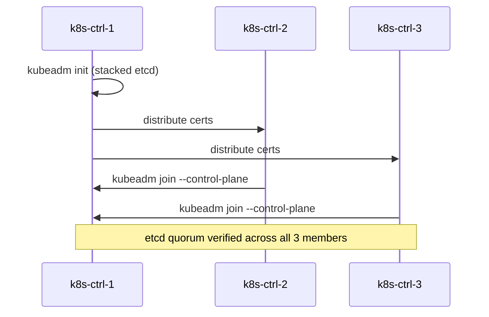
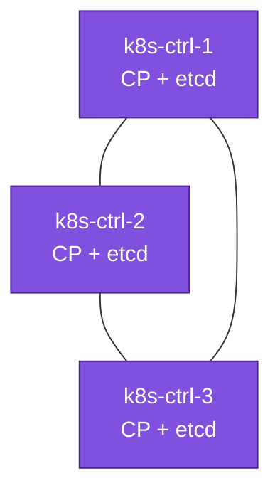

# 08. Bootstrap — Stacked etcd (Scenario A)

**Goal:** Initialize the HA control plane with `kubeadm`, etcd stacked on each control-plane node.

## Covers
- `kubeadm init` on `k8s-ctrl-1` with the apiserver VIP/LB endpoint from [07-load-balancer.md](07-load-balancer.md)
- Certificate distribution to `k8s-ctrl-2` / `k8s-ctrl-3`
- `kubeadm join --control-plane` on the remaining control-plane nodes
- Verifying etcd cluster health across all 3 members

## Bootstrap sequence

## Applies to
Scenario A only.

## Prerequisites
- [07-load-balancer.md](07-load-balancer.md)
- [02-hardware-inventory.md](02-hardware-inventory.md) — Scenario A table

## Next
- [09-join-nodes.md](09-join-nodes.md)
