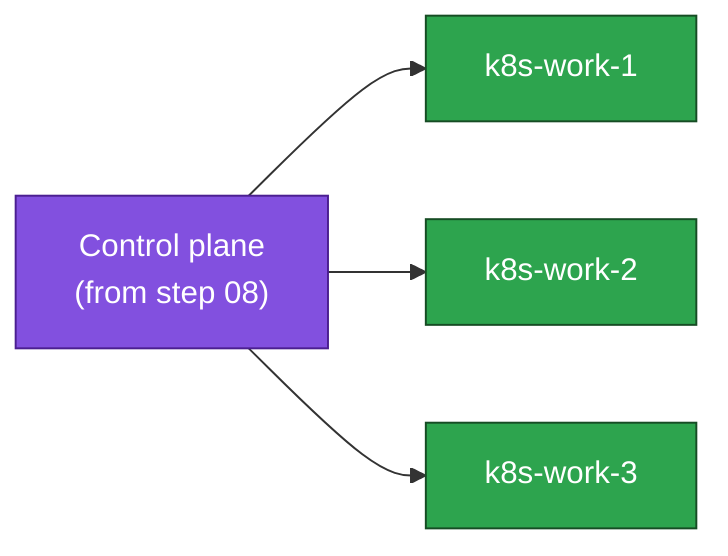

# 09. Join Worker Nodes

**Goal:** Join the worker nodes to the control plane bootstrapped in the previous step.

## Covers
- `kubeadm join` on `k8s-work-1/2/3`
- Verifying node `Ready` status (will stay `NotReady` until CNI is installed)
- Node labels/taints if any are needed for this lab

## Join flow

## Applies to
Both scenarios.

## Prerequisites
- [08-stacked-etcd-bootstrap.md](08-stacked-etcd-bootstrap.md) or [08-external-etcd-bootstrap.md](08-external-etcd-bootstrap.md)

## Next
- [10-cni.md](10-cni.md)
