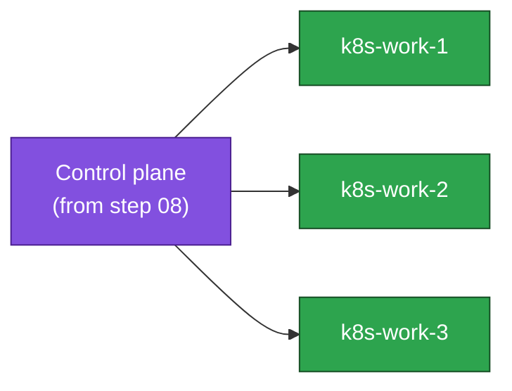

# 09. Join Worker Nodes

**Goal:** Join the worker nodes to the control plane bootstrapped in the previous step.

## Steps

**1. On each worker** — same Kubernetes apt repo **and the same exact `KUBE_DEPLOY_VERSION`** as the control-plane nodes ([08-bootstrap.md](08-bootstrap.md) step 5) — every node in the cluster starts on the identical pinned patch version, no exceptions. `kubelet` + `kubeadm` only (`kubectl` isn't needed on workers for this lab):
```sh
sudo apt install -y kubelet=${KUBE_DEPLOY_VERSION} kubeadm=${KUBE_DEPLOY_VERSION}
sudo apt-mark hold kubelet kubeadm
```

**2. Join** — run the plain (non-`--control-plane`) join command printed by `kubeadm init` in step 08:
```sh
sudo kubeadm join 10.0.1.10:6443 --token <token> \
  --discovery-token-ca-cert-hash sha256:<hash>
```
Token expired or lost? Generate a new one from `k8s-ctrl-1`: `sudo kubeadm token create --print-join-command`.

**3. Verify** (from `k8s-ctrl-1`, or your workstation with `~/.kube/config` copied over):
```sh
kubectl get nodes -o wide
```
All nodes show up but stay `NotReady` until [10-cni.md](10-cni.md) installs pod networking — expected here.

## Join flow



## Applies to
Light profile, either etcd scenario.

## Prerequisites
- [08-bootstrap.md](08-bootstrap.md)

## Next
- [10-cni.md](10-cni.md)
