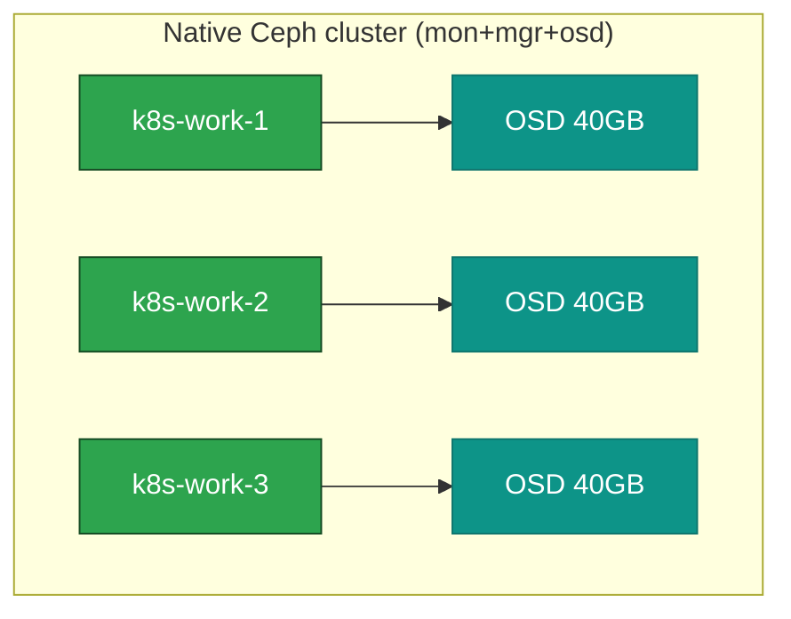

# 11. Storage — Ceph (native) + Ceph-CSI

**Goal:** Bootstrap Ceph as native `apt` packages/systemd services on the worker nodes (no Rook operator pods — see [00-overview.md](../../00-overview.md)), then let Kubernetes consume it via the lean Ceph-CSI driver.

Mon + mgr + OSD are co-located on `k8s-work-1/2/3` — 3 mons for quorum, one OSD per node using the dedicated Ceph disk from [02-hardware-inventory.md](../../02-hardware-inventory.md).

Debian's own repo only ever carries one Ceph release per Debian release, which leaves nothing to upgrade *to* later — and as of 2026-09 it bundles Reef (`18.2.7+ds-1+deb13u1`), which upstream Ceph already fully retired in March 2026 (final release 18.2.8). So this uses Ceph's own apt repo instead, pinned to a specific release codename — deliberately one release behind current stable (same reasoning as the Kubernetes version pin in [08-bootstrap.md](08-bootstrap.md)), so [15-day2-operations.md](15-day2-operations.md) has a real Ceph upgrade to walk through: **Squid (v19.x) → Tentacle (v20.x)**.

> **Debian 13/Trixie caveat, checked 2026-09:** Ceph's own [OS recommendations](https://docs.ceph.com/en/latest/start/os-recommendations/) list Debian 13 as tier "C" — packages exist but aren't tested by the Ceph project itself — and there are real-world reports of `download.ceph.com`'s Debian repos not resolving cleanly on Trixie yet. Try the repo below first; if `apt update` fails against it, that's the known gap, and your fallback is Debian's own bundled Reef packages (`apt-cache policy ceph-common`) purely to get *a* working cluster for this lab — know that it's already past upstream EOL, so treat it as a stopgap, not something to run for real.

## Steps — native Ceph cluster (run on `k8s-work-1/2/3`)

**1. Add Ceph's repo and install a pinned release** (all 3 nodes — check [docs.ceph.com/en/latest/releases](https://docs.ceph.com/en/latest/releases/) for current/supported releases before running, and see the Debian 13 caveat above):
```sh
CEPH_DEPLOY_RELEASE=squid   # v19.x — current stable as of 2026-09 (19.2.6), scheduled EOL 2026-10-31; reverify at docs.ceph.com/en/latest/releases
curl -fsSL https://download.ceph.com/keys/release.asc | sudo gpg --dearmor -o /usr/share/keyrings/ceph.gpg
echo "deb [signed-by=/usr/share/keyrings/ceph.gpg] https://download.ceph.com/debian-${CEPH_DEPLOY_RELEASE}/ $(lsb_release -sc) main" \
  | sudo tee /etc/apt/sources.list.d/ceph.list
sudo apt update

apt-cache madison ceph-common   # list exact available versions for this release — pick one; 19.2.6 was latest as of 2026-09
CEPH_DEPLOY_VERSION="19.2.6-1~$(lsb_release -sc)"   # confirm this exact string against the madison output above

sudo apt install -y ceph-mon=${CEPH_DEPLOY_VERSION} ceph-mgr=${CEPH_DEPLOY_VERSION} \
  ceph-osd=${CEPH_DEPLOY_VERSION} ceph-common=${CEPH_DEPLOY_VERSION}
sudo apt-mark hold ceph-mon ceph-mgr ceph-osd ceph-common
```
Use the same `CEPH_DEPLOY_VERSION` on all three nodes.

**2. Generate cluster identity + config** (once, e.g. on `k8s-work-1`):
```sh
FSID=$(uuidgen)
echo "$FSID"   # save this — you'll need it again for Ceph-CSI's clusterID
sudo tee /etc/ceph/ceph.conf <<EOF
[global]
fsid = ${FSID}
mon initial members = k8s-work-1, k8s-work-2, k8s-work-3
mon host = 10.0.1.21, 10.0.1.22, 10.0.1.23
public network = 10.0.1.0/24
auth cluster required = cephx
auth service required = cephx
auth client required = cephx
osd pool default size = 3
EOF
```
Copy this `ceph.conf` to `/etc/ceph/ceph.conf` on all 3 nodes.

**3. Generate keyrings and monmap** (once, on `k8s-work-1`, then copy the resulting files to the other two):
```sh
sudo ceph-authtool --create-keyring /tmp/ceph.mon.keyring --gen-key -n mon. --cap mon 'allow *'
sudo ceph-authtool --create-keyring /etc/ceph/ceph.client.admin.keyring --gen-key \
  -n client.admin --cap mon 'allow *' --cap osd 'allow *' --cap mds 'allow *' --cap mgr 'allow *'
sudo ceph-authtool /tmp/ceph.mon.keyring --import-keyring /etc/ceph/ceph.client.admin.keyring

sudo monmaptool --create --fsid "$FSID" \
  --add k8s-work-1 10.0.1.21 --add k8s-work-2 10.0.1.22 --add k8s-work-3 10.0.1.23 \
  /tmp/monmap
```
Copy `/tmp/ceph.mon.keyring`, `/tmp/monmap`, and `/etc/ceph/ceph.client.admin.keyring` to the same paths on `k8s-work-2`/`k8s-work-3`.

**4. Bootstrap each mon** (all 3 nodes, same commands, substitute the local hostname):
```sh
sudo -u ceph mkdir -p /var/lib/ceph/mon/ceph-k8s-work-1
sudo -u ceph ceph-mon --mkfs -i k8s-work-1 --monmap /tmp/monmap --keyring /tmp/ceph.mon.keyring
sudo systemctl enable --now ceph-mon@k8s-work-1
```

**5. Bootstrap mgr** (all 3 nodes):
```sh
sudo ceph auth get-or-create mgr.k8s-work-1 mon 'allow profile mgr' osd 'allow *' mds 'allow *' \
  -o /var/lib/ceph/mgr/ceph-k8s-work-1/keyring
sudo mkdir -p /var/lib/ceph/mgr/ceph-k8s-work-1 && sudo chown ceph:ceph /var/lib/ceph/mgr/ceph-k8s-work-1
sudo systemctl enable --now ceph-mgr@k8s-work-1
```

**6. Bring up the OSD** on each worker's dedicated Ceph disk (confirm the device name with `lsblk` first — don't assume `/dev/sdb`):
```sh
sudo ceph-volume lvm create --data /dev/sdb
```

**7. Verify:**
```sh
sudo ceph -s   # expect 3 mons in quorum, 3 osds up/in
```

## Steps — expose storage to Kubernetes via Ceph-CSI

**8. Create a pool and a scoped client for CSI:**
```sh
sudo ceph osd pool create kubernetes
sudo rbd pool init kubernetes
sudo ceph auth get-or-create client.kubernetes \
  mon 'profile rbd' osd 'profile rbd pool=kubernetes' mgr 'profile rbd pool=kubernetes' \
  -o /etc/ceph/ceph.client.kubernetes.keyring
sudo ceph auth print-key client.kubernetes   # save this key for the Secret below
```

**9. Deploy a pinned Ceph-CSI RBD driver version via Helm** (check [github.com/ceph/ceph-csi](https://github.com/ceph/ceph-csi) for the current chart version list):
```sh
helm repo add ceph-csi https://ceph.github.io/csi-charts && helm repo update
helm search repo ceph-csi/ceph-csi-rbd --versions | head   # pick an exact chart version
CEPH_CSI_CHART_VERSION="<version from the list above>"
kubectl create namespace ceph-csi-rbd
helm install ceph-csi-rbd ceph-csi/ceph-csi-rbd -n ceph-csi-rbd --version "${CEPH_CSI_CHART_VERSION}" \
  --set csiConfig[0].clusterID="${FSID}" \
  --set csiConfig[0].monitors[0]=10.0.1.21:6789 \
  --set csiConfig[0].monitors[1]=10.0.1.22:6789 \
  --set csiConfig[0].monitors[2]=10.0.1.23:6789
```

**10. Secret + StorageClass:**
```sh
kubectl create secret generic csi-rbd-secret -n ceph-csi-rbd \
  --from-literal=userID=kubernetes --from-literal=userKey=<key from step 8>

cat <<EOF | kubectl apply -f -
apiVersion: storage.k8s.io/v1
kind: StorageClass
metadata:
  name: ceph-rbd
provisioner: rbd.csi.ceph.com
parameters:
  clusterID: "${FSID}"
  pool: kubernetes
  csi.storage.k8s.io/provisioner-secret-name: csi-rbd-secret
  csi.storage.k8s.io/provisioner-secret-namespace: ceph-csi-rbd
  csi.storage.k8s.io/node-stage-secret-name: csi-rbd-secret
  csi.storage.k8s.io/node-stage-secret-namespace: ceph-csi-rbd
reclaimPolicy: Delete
allowVolumeExpansion: true
EOF
```

**11. Verify** with a test PVC — confirm it reaches `Bound`, then delete it.

## Ceph cluster layout



## Applies to
Light profile, either etcd scenario (storage layout is identical — only control-plane/etcd topology differs between scenarios).

## Prerequisites
- [10-cni.md](10-cni.md)

## Next
- [12-ingress.md](12-ingress.md)
