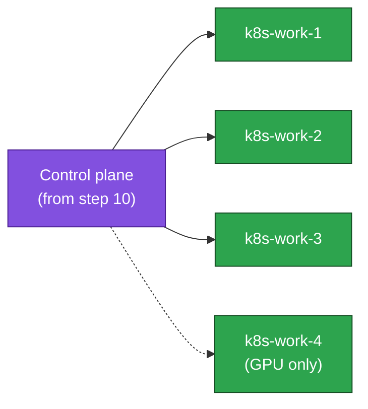

# 11. Join Worker Nodes

**Goal:** Join the worker nodes to the control plane bootstrapped in the previous step.

## Steps

**1. On each worker** — add the **same** Kubernetes apt repo and install the **same exact** `KUBE_DEPLOY_VERSION` as the control-plane nodes ([10-bootstrap-stacked.md](10-bootstrap-stacked.md) step 1, or [10-bootstrap-external.md](10-bootstrap-external.md) step 5). Workers never ran step 10, so the repo is not there yet. `kubelet` + `kubeadm` only (`kubectl` isn't needed on workers for this lab):
```sh
KUBE_DEPLOY_MINOR=v1.36            # MUST match step 10
KUBE_DEPLOY_VERSION="1.36.4-1.1"   # MUST match step 10 exactly — copy the string, don't pick a new one
sudo mkdir -p /etc/apt/keyrings
curl -fsSL "https://pkgs.k8s.io/core:/stable:/${KUBE_DEPLOY_MINOR}/deb/Release.key" \
  | sudo gpg --dearmor -o /etc/apt/keyrings/kubernetes-apt-keyring.gpg
echo "deb [signed-by=/etc/apt/keyrings/kubernetes-apt-keyring.gpg] https://pkgs.k8s.io/core:/stable:/${KUBE_DEPLOY_MINOR}/deb/ /" \
  | sudo tee /etc/apt/sources.list.d/kubernetes.list
sudo apt update
sudo apt install -y kubelet=${KUBE_DEPLOY_VERSION} kubeadm=${KUBE_DEPLOY_VERSION}
sudo apt-mark hold kubelet kubeadm
sudo systemctl enable kubelet
```

**2. Join** — run the plain (non-`--control-plane`) join command printed by `kubeadm init` in step 10:
```sh
sudo kubeadm join 10.0.1.10:6443 --token <token> \
  --discovery-token-ca-cert-hash sha256:<hash>
```
Token expired or lost? Generate a new one from `k8s-ctrl-1`: `sudo kubeadm token create --print-join-command`.

**GPU profile:** also join `k8s-work-4` here (same commands). Driver, device plugin, and taint are [20-gpu-node.md](20-gpu-node.md), after the rest of the cluster is up.

**3. Verify** (from `k8s-ctrl-1`, or your workstation with `~/.kube/config` copied over):
```sh
kubectl get nodes -o wide
```
All nodes show up but stay `NotReady` until [12-cni.md](12-cni.md) installs pod networking — expected here.

## Join flow



## Prerequisites
- [10-bootstrap-stacked.md](10-bootstrap-stacked.md) or [10-bootstrap-external.md](10-bootstrap-external.md)

## Next
- [12-cni.md](12-cni.md)
