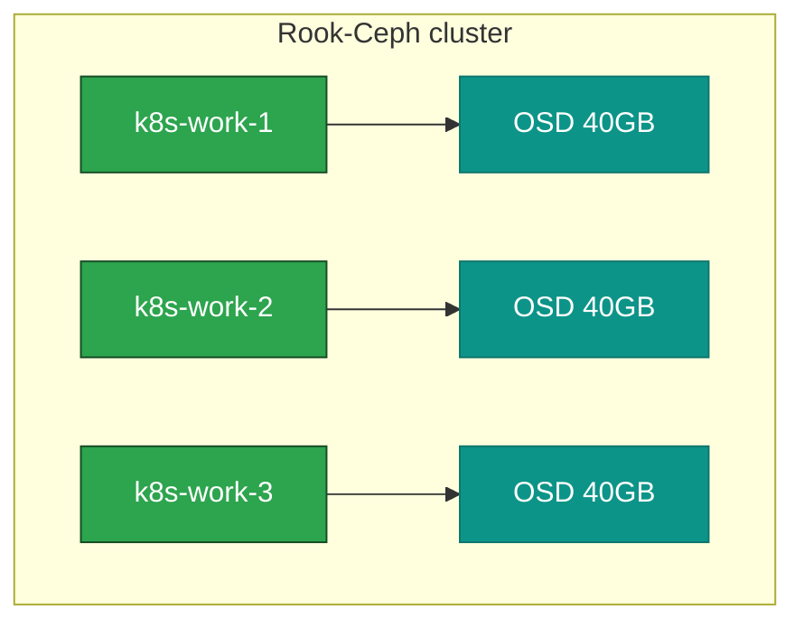

# 11. Storage — Ceph (Rook)

**Goal:** Deploy Rook-Ceph using the raw OSD disks attached to the worker nodes.

## Covers
- Rook operator installation
- CephCluster CR using the OSD devices/disks defined in [02-hardware-inventory.md](02-hardware-inventory.md)
- StorageClass creation (block/RBD, and CephFS if needed)
- Verifying Ceph cluster health (`ceph -s` via toolbox pod)

## Ceph cluster layout

## Applies to
Both scenarios (storage layout is identical — only control-plane/etcd topology differs between scenarios).

## Prerequisites
- [10-cni.md](10-cni.md)

## Next
- [12-ingress.md](12-ingress.md)
