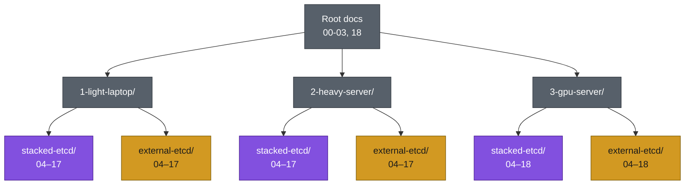

# kubernetes-lab

Build a production-like Kubernetes cluster from scratch for hands-on learning, covering high availability, networking, storage, security, and cluster administration.

## Scope

This repo documents cluster deployment on top of a set of already-provisioned VMs. **VM/host provisioning is out of scope** — bring your own VMs (manual install, Ansible, a cloud provider, or any other method), reachable over SSH with a base OS installed. The node count and roles you need are defined in this documentation.

## Layout

General, host/scenario-agnostic reference lives at the repo root:

| Doc | Covers |
|---|---|
| [00-overview.md](00-overview.md) | Scope, the three deployment profiles, fixed technical decisions, version-pinning policy, diagram color legend |
| [01-scenarios.md](01-scenarios.md) | Internal (stacked) vs. external etcd trade-offs |
| [02-hardware-inventory.md](02-hardware-inventory.md) | VM sizing for every profile × scenario combination |
| [03-network-plan.md](03-network-plan.md) | Addressing, ports, DNS |
| [18-deployment-log.md](18-deployment-log.md) | Template for recording exactly what got deployed, when |

Everything from step 04 onward is **profile- and scenario-specific**, so it lives in its own directory instead of the repo root:

```
1-light-laptop/
  stacked-etcd/   (Laptop, 3 stacked control-plane nodes)
  external-etcd/   (Laptop, 2 control-plane + 3 dedicated etcd)
2-heavy-server/
  stacked-etcd/   (Server, same shape as Light, bigger nodes)
  external-etcd/
3-gpu-server/
  stacked-etcd/   (Server, Heavy + a tainted NVIDIA worker)
  external-etcd/
```

Each of those 6 directories is self-contained: `04-prerequisites.md` through `17-troubleshooting.md` (the `3-gpu-server/` ones also get a `18-gpu-node.md`), with real commands, real IPs, and no cross-directory conditionals — pick your directory once and everything in it applies as written. Start at that directory's `04-prerequisites.md` after reading the root docs above.



Purple = internal/stacked etcd, amber = external etcd, gray = shared/general. Same palette as everywhere else — see the full [color legend](00-overview.md#diagram-color-legend).

## Deployment profiles

Three independent instances of this lab, never joined together (they reuse the same IP plan) — see [00-overview.md](00-overview.md#deployment-profiles) for the full explanation:

| Profile | Host | Notes |
|---|---|---|
| **Light** | Laptop | Capped CPU share, smaller nodes. Deploy this one first. |
| **Heavy** | Server | Same shape as Light, bigger nodes. |
| **GPU** | Server | Heavy + one GPU worker (`k8s-work-4`), passed-through NVIDIA, tainted. |

## Rollout plan

1. **Light (laptop) — current task.** Build and validate **both** etcd scenarios here first — [1-light-laptop/stacked-etcd/](1-light-laptop/stacked-etcd/) and [1-light-laptop/external-etcd/](1-light-laptop/external-etcd/) — since it's the smallest, cheapest place to shake out mistakes (including running each through [16-day2-operations.md](1-light-laptop/stacked-etcd/16-day2-operations.md)'s upgrade exercise) before repeating the same steps on the server.
2. **Heavy (server)** — once both Light scenarios are healthy end to end. [2-heavy-server/stacked-etcd/](2-heavy-server/stacked-etcd/) and [2-heavy-server/external-etcd/](2-heavy-server/external-etcd/) currently hold only a README explaining how to carry Light's (by-then proven) steps over, adjusted for the Heavy hardware numbers in [02-hardware-inventory.md](02-hardware-inventory.md).
3. **GPU (server)** — add `k8s-work-4` and a `18-gpu-node.md` on top of a healthy Heavy deployment, rather than bootstrapping GPU from scratch. [3-gpu-server/stacked-etcd/](3-gpu-server/stacked-etcd/) and [3-gpu-server/external-etcd/](3-gpu-server/external-etcd/) are stubs for now, same as Heavy's.

Record the exact pinned component versions used on each run in [18-deployment-log.md](18-deployment-log.md).

## Scenarios

Two supported control-plane/etcd topologies, built into the directory layout above rather than chosen via a flag — trade-offs explained in [01-scenarios.md](01-scenarios.md):

- **Stacked etcd**: 3 control-plane nodes, etcd co-located on each.
- **External etcd**: 2 control-plane nodes + 3 dedicated etcd nodes.

## Status

[1-light-laptop/stacked-etcd/](1-light-laptop/stacked-etcd/) and [1-light-laptop/external-etcd/](1-light-laptop/external-etcd/) have real, runnable procedure (commands, configs, pinned-version installs) for steps 04–17; each directory's `17-troubleshooting.md` stays an outline until issues actually come up during a run-through. `2-heavy-server/` and `3-gpu-server/` are stubs pending the rollout plan above. Versions/URLs marked "verify current" throughout are deliberately not hardcoded — check them against upstream before running, don't trust them as pinned.
