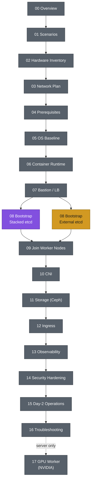

# kubernetes-lab

Build a production-like Kubernetes cluster from scratch for hands-on learning, covering high availability, networking, storage, security, and cluster administration.

## Scope

This repo documents cluster deployment on top of a set of already-provisioned VMs. **VM/host provisioning is out of scope** — bring your own VMs (manual install, Ansible, a cloud provider, or any other method), reachable over SSH with a base OS installed. The node count and roles you need are defined in this documentation.

## Environments

Two independent hosts, each running its own instance of this lab (never joined together — they reuse the same IP plan): a **laptop** (capped CPU share, smaller nodes) and a **server** (larger nodes, dedicated NVMe for root vs. Ceph OSD, one GPU worker). Both use the same deployment steps below; sizing for each lives in [02-hardware-inventory.md](02-hardware-inventory.md).

## Scenarios

Two supported control-plane/etcd topologies — pick one before you provision VMs. Details and trade-offs: [01-scenarios.md](01-scenarios.md).

- **Scenario A — Stacked etcd**: 3 control-plane nodes, etcd co-located on each.
- **Scenario B — External etcd**: 2 control-plane nodes + 3 dedicated etcd nodes.

## Deployment steps

Each step is its own file in the repo root, numbered in the order you follow them. Steps common to both scenarios carry only a number; step 08 is where the two paths fork, so it carries a `stacked-etcd`/`external-etcd` prefix — use whichever file matches the scenario you picked, then continue with the numbered steps.

| Step | Doc | Applies to |
|---|---|---|
| 00 | [Overview](00-overview.md) | Both |
| 01 | [Deployment Scenarios](01-scenarios.md) | Both |
| 02 | [Hardware Inventory](02-hardware-inventory.md) | Both |
| 03 | [Network Plan](03-network-plan.md) | Both |
| 04 | [Prerequisites](04-prerequisites.md) | Both |
| 05 | [OS Baseline](05-os-baseline.md) | Both |
| 06 | [Container Runtime](06-container-runtime.md) | Both |
| 07 | [Bastion / Load Balancer](07-load-balancer.md) | Both |
| 08 | [Bootstrap — Stacked etcd](08-stacked-etcd-bootstrap.md) | Scenario A |
| 08 | [Bootstrap — External etcd](08-external-etcd-bootstrap.md) | Scenario B |
| 09 | [Join Worker Nodes](09-join-nodes.md) | Both |
| 10 | [CNI](10-cni.md) | Both |
| 11 | [Storage — Ceph](11-storage-ceph.md) | Both |
| 12 | [Ingress](12-ingress.md) | Both |
| 13 | [Observability](13-observability.md) | Both |
| 14 | [Security Hardening](14-security-hardening.md) | Both |
| 15 | [Day-2 Operations](15-day2-operations.md) | Both |
| 16 | [Troubleshooting](16-troubleshooting.md) | Both |
| 17 | [GPU Worker (NVIDIA)](17-gpu-node.md) | Server only |

Purple = Scenario A (stacked etcd), amber = Scenario B (external etcd), gray = shared steps. See the full [color legend](00-overview.md#diagram-color-legend).

## Status

Steps 00–15 and 17 have real, runnable procedure (commands, configs, package-hold policy). [16-troubleshooting.md](16-troubleshooting.md) stays an outline until issues actually come up during a run-through. Versions/URLs marked "verify current" throughout are deliberately not hardcoded — check them against upstream before running, don't trust them as pinned.
