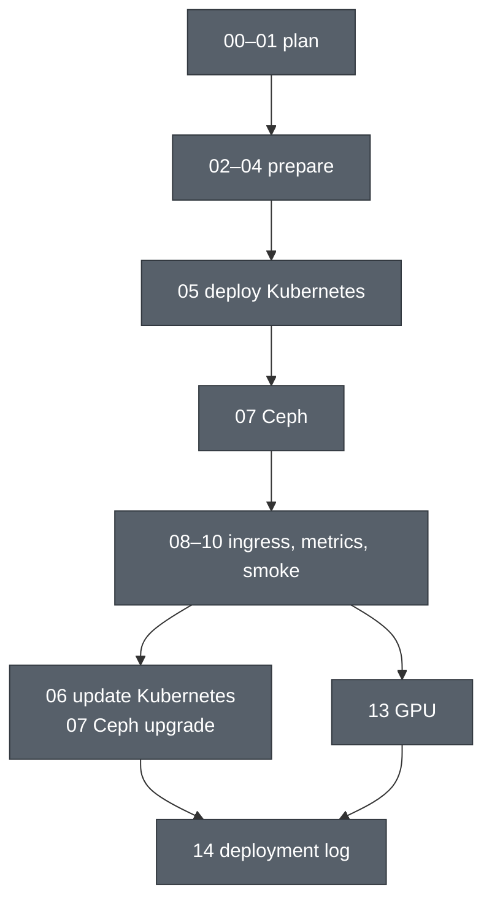

# kubernetes-lab

Build a production-like Kubernetes cluster from scratch for hands-on learning, covering high availability, networking, storage, security, and cluster administration.

## Scope

This repo documents cluster deployment on top of a set of already-provisioned VMs. **VM/host provisioning is out of scope** — bring your own VMs (manual install, Ansible, a cloud provider, or any other method), reachable over SSH with a base OS installed. The node count and roles you need are defined in this documentation.

## Layout

One numbered spine. Circle a profile × scenario in [01-inventory.md](01-inventory.md) and one distro (Debian 13 or Ubuntu 26), then walk 02 → 10. The only branch is inside [05-deploy-kubernetes.md](05-deploy-kubernetes.md) (stacked or external bootstrap). GPU adds [13-gpu.md](13-gpu.md) after a healthy Heavy cluster. Site WAN/LAN addresses stay out of this repo — tables use example LAN IPs.

| Doc | Covers |
|---|---|
| [00-overview.md](00-overview.md) | Scope, profiles, scenarios, version pins |
| [01-inventory.md](01-inventory.md) | VM tables and the LAN plan, including the API load-balancer pair |
| [02-prepare.md](02-prepare.md) | Prerequisites and OS baseline |
| [03-firewall.md](03-firewall.md) | Gateway keepalived pair |
| [04-bastion.md](04-bastion.md) | Docker Compose: Nexus, Prometheus, Grafana |
| [05-deploy-kubernetes.md](05-deploy-kubernetes.md) | containerd, API HAProxy pair, bootstrap, join, Calico, kubectl, Helm |
| [06-update-kubernetes.md](06-update-kubernetes.md) | Kubernetes, Calico, and external-etcd upgrades |
| [07-ceph.md](07-ceph.md) | Ceph deploy and Ceph upgrade |
| [08-ingress.md](08-ingress.md) | Traefik, published on the API pair |
| [09-observability.md](09-observability.md) | node_exporter |
| [10-smoke-test.md](10-smoke-test.md) | Smoke and stress |
| [11-security.md](11-security.md) | Hardening outline |
| [12-troubleshooting.md](12-troubleshooting.md) | Notes filled in as a run hits them |
| [13-gpu.md](13-gpu.md) | GPU profile only |
| [14-deployment-log.md](14-deployment-log.md) | What was actually pinned, per run |

```mermaid
flowchart TD
    Plan["00–01 plan"]:::common
    Plan --> Prep["02–04 prepare"]:::common
    Prep --> K8s["05 deploy Kubernetes"]:::common
    K8s --> Ceph["07 Ceph"]:::common
    Ceph --> Rest["08–10 ingress, metrics, smoke"]:::common
    Rest --> Up["06 update Kubernetes\n07 Ceph upgrade"]:::common
    Rest --> GPU["13 GPU"]:::common
    Up --> Log["14 deployment log"]:::common
    GPU --> Log

    classDef common fill:#57606a,stroke:#32383f,color:#ffffff
```

Same palette as everywhere else — see the [color legend](00-overview.md#diagram-color-legend).

## Deployment profiles

Three independent instances of this lab, never joined together (they reuse the same IP plan) — see [00-overview.md](00-overview.md#deployment-profiles). Pick the matching table in [01-inventory.md](01-inventory.md); the procedure files do not change.

| Profile | Host | Notes |
|---|---|---|
| **Light** | Laptop | Two firewalls, two API proxies, bastion (jump + kubectl/Helm + Nexus + metrics), smaller nodes. Deploy this one first. |
| **Heavy** | Server | Same shape as Light, bigger nodes. |
| **GPU** | Server | Heavy + one GPU worker (`k8s-work-4`), passed-through NVIDIA, tainted. |

## Rollout plan

1. **Light (laptop) — current task.** Walk 02–10 on **Debian 13 first**, then the same path on Ubuntu 26 — not both at once. One etcd scenario per pass (stacked section of [05-deploy-kubernetes.md](05-deploy-kubernetes.md), later the external section), including [06-update-kubernetes.md](06-update-kubernetes.md) and the Ceph upgrade in [07-ceph.md](07-ceph.md).
2. **Heavy (server)** — same spine, Heavy tables in [01-inventory.md](01-inventory.md).
3. **GPU (server)** — Heavy plus `k8s-work-4` (joined in 05, OSD in 07) and [13-gpu.md](13-gpu.md).

Record the exact pinned component versions used on each run in [14-deployment-log.md](14-deployment-log.md).

## Scenarios

Two control-plane/etcd topologies — trade-offs in [00-overview.md](00-overview.md#scenarios):

- **Stacked etcd:** 3 control-plane nodes, etcd co-located on each. Bootstrap section in [05-deploy-kubernetes.md](05-deploy-kubernetes.md).
- **External etcd:** 2 control-plane nodes + 3 dedicated etcd nodes. The other bootstrap section in the same file.

## Status

02–10 and 06–07 have runnable procedure (commands, configs, pinned-version installs). [11-security.md](11-security.md) and [12-troubleshooting.md](12-troubleshooting.md) stay outlines until a real run fills them in. [13-gpu.md](13-gpu.md) is an outline pending the first GPU run. Versions marked "verify current" are not promises — check them against upstream before running.
