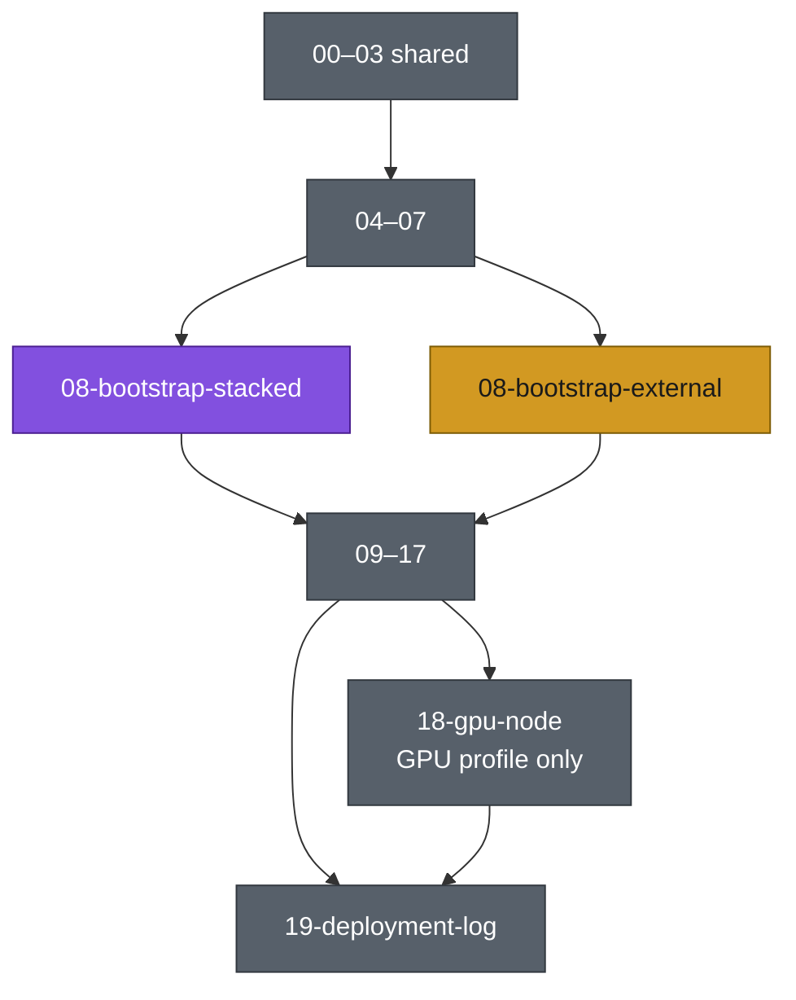

# kubernetes-lab

Build a production-like Kubernetes cluster from scratch for hands-on learning, covering high availability, networking, storage, security, and cluster administration.

## Scope

This repo documents cluster deployment on top of a set of already-provisioned VMs. **VM/host provisioning is out of scope** — bring your own VMs (manual install, Ansible, a cloud provider, or any other method), reachable over SSH with a base OS installed. The node count and roles you need are defined in this documentation.

## Layout

One numbered spine at the repo root. Circle a profile × scenario in [02-hardware-inventory.md](02-hardware-inventory.md), then walk 04 → 17. The only real branch is step 08 (two bootstrap files). GPU adds [18-gpu-node.md](18-gpu-node.md) after a healthy Heavy cluster.

| Doc | Covers |
|---|---|
| [00-overview.md](00-overview.md) | Scope, the three deployment profiles, fixed technical decisions, version-pinning policy, diagram color legend |
| [01-scenarios.md](01-scenarios.md) | Stacked vs. external etcd trade-offs |
| [02-hardware-inventory.md](02-hardware-inventory.md) | VM sizing for every profile × scenario combination |
| [03-network-plan.md](03-network-plan.md) | Addressing, ports, DNS |
| [04-prerequisites.md](04-prerequisites.md) … [17-troubleshooting.md](17-troubleshooting.md) | Procedure (same commands for Light/Heavy/GPU; profile notes where the node list differs) |
| [08-bootstrap-stacked.md](08-bootstrap-stacked.md) / [08-bootstrap-external.md](08-bootstrap-external.md) | The scenario fork — open **one** |
| [18-gpu-node.md](18-gpu-node.md) | GPU profile only: NVIDIA driver, toolkit, taint, device plugin |
| [19-deployment-log.md](19-deployment-log.md) | Template for recording exactly what got deployed, when |

```mermaid
flowchart TD
    Root["00–03 shared"]:::common
    Root --> P04["04–07"]:::common
    P04 --> S08["08-bootstrap-stacked"]:::scenarioA
    P04 --> E08["08-bootstrap-external"]:::scenarioB
    S08 --> Rest["09–17"]:::common
    E08 --> Rest
    Rest --> GPU["18-gpu-node\nGPU profile only"]:::common
    Rest --> Log["19-deployment-log"]:::common
    GPU --> Log

    classDef common fill:#57606a,stroke:#32383f,color:#ffffff
    classDef scenarioA fill:#8250df,stroke:#4b1f91,color:#ffffff
    classDef scenarioB fill:#d29922,stroke:#7d5c05,color:#1a1a1a
```

Purple = stacked etcd, amber = external etcd, gray = shared. Same palette as everywhere else — see the full [color legend](00-overview.md#diagram-color-legend).

## Deployment profiles

Three independent instances of this lab, never joined together (they reuse the same IP plan) — see [00-overview.md](00-overview.md#deployment-profiles). Pick the matching table in [02-hardware-inventory.md](02-hardware-inventory.md); the procedure files do not change.

| Profile | Host | Notes |
|---|---|---|
| **Light** | Laptop | Capped CPU share, smaller nodes, dedicated `k8s-monitor`. Deploy this one first. |
| **Heavy** | Server | Same shape as Light, bigger nodes. Prometheus/Grafana on the bastion. |
| **GPU** | Server | Heavy + one GPU worker (`k8s-work-4`), passed-through NVIDIA, tainted. |

## Rollout plan

1. **Light (laptop) — current task.** Walk 04–17 twice, once per etcd scenario (open [08-bootstrap-stacked.md](08-bootstrap-stacked.md) then [08-bootstrap-external.md](08-bootstrap-external.md)), including the upgrade exercise in [16-day2-operations.md](16-day2-operations.md). Smallest, cheapest place to shake out mistakes.
2. **Heavy (server)** — same spine, Heavy tables in [02-hardware-inventory.md](02-hardware-inventory.md). Omit `k8s-monitor`; Prometheus/Grafana live on `k8s-bastion` ([13-observability.md](13-observability.md)).
3. **GPU (server)** — Heavy plus `k8s-work-4` (joined in 09, OSD in 11) and [18-gpu-node.md](18-gpu-node.md), rather than bootstrapping GPU from scratch.

Record the exact pinned component versions used on each run in [19-deployment-log.md](19-deployment-log.md).

## Scenarios

Two supported control-plane/etcd topologies — trade-offs in [01-scenarios.md](01-scenarios.md):

- **Stacked etcd:** 3 control-plane nodes, etcd co-located on each — [08-bootstrap-stacked.md](08-bootstrap-stacked.md).
- **External etcd:** 2 control-plane nodes + 3 dedicated etcd nodes — [08-bootstrap-external.md](08-bootstrap-external.md).

## Status

Steps 04–14 and 16 have real, runnable procedure (commands, configs, pinned-version installs). [15-security-hardening.md](15-security-hardening.md) and [17-troubleshooting.md](17-troubleshooting.md) stay outlines until a real run fills them in. [18-gpu-node.md](18-gpu-node.md) is an outline pending the first GPU run. Versions/URLs marked "verify current" throughout are deliberately not hardcoded — check them against upstream before running, don't trust them as pinned.
